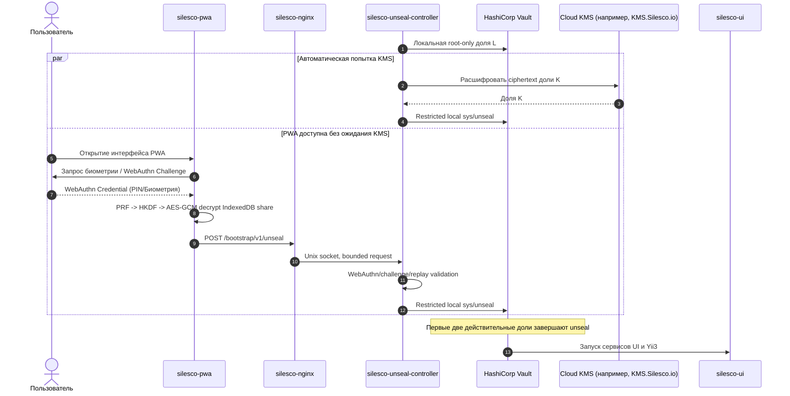
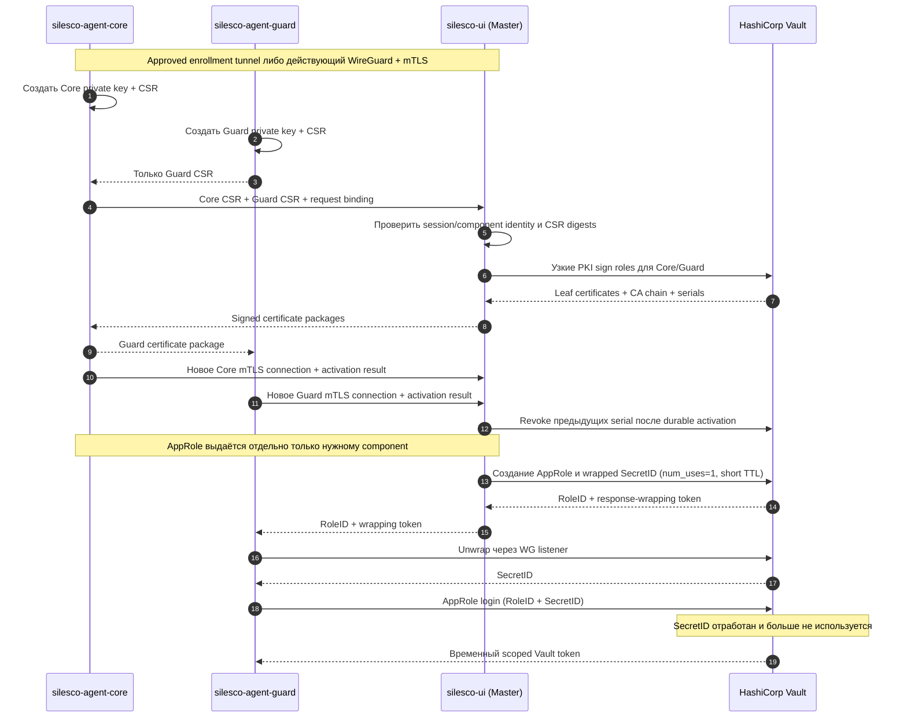

# Silesco.io — Модуль 1. Безопасность и управление секретами

**Лицензия документа:** CC BY 4.0; runtime лицензируется отдельно
**Репозиторий:** GitLab
**Дата:** 2026
**Версия архитектурного baseline:** 1.19.2 (не версия продукта)

---

## 1. Конфигурация HashiCorp Vault

HashiCorp Vault является ядром безопасности проекта Silesco.io. Он изолирован во внутренней Docker-сети `silesco_backend`. Публичный Nginx никогда не проксирует Vault API. Интерактивный unseal проходит через отдельный минимальный `silesco-unseal-controller`; для Agent-нод Vault поднимает другой TLS listener, привязанный к WireGuard-интерфейсу и защищённый mTLS, Vault policies и AppRole.

### Инварианты хранения секретов (SEC-04):
* Секреты разделены на статические (KV Secrets Engine v2) и динамические (Database Secrets Engine).
* **Unseal-ключи никогда не передаются и не хранятся на Agent-нодах.** Любая компрометация удалённого сервера [2] не должна вести к компрометации мастер-ключей Vault на Master-ноде [2].

---

## 2. Схемы разблокировки Vault (Unseal)

Vault использует обычный Shamir seal с четырьмя независимыми долями и порогом `2 из 4`. Стандартный Vault Transit/KMS auto-seal не используется: удаление внешнего seal key не должно делать локальный Vault невосстановимым.

```
L — локальная root-only доля Master
P — доля PWA, зашифрованная WebAuthn PRF → HKDF → AES-256-GCM
K — доля, ciphertext которой хранится на Master и расшифровывается через KMS
R — независимая offline recovery-доля пользователя

Порог разблокировки: любые 2 из 4.
```

**Native representation (ADR-086):** в закреплённом Vault 2.0.3 каждая доля
имеет 33 raw bytes: 32 bytes значения плюс coordinate/index Shamir. Hex literal
содержит 66 lowercase characters; Base64 того же полного material — 44 characters.
PGP ciphertext/Base64 ciphertext, decrypted hex literal и raw share являются
разными представлениями и не смешиваются. Доля не является 32-byte AES key:
нельзя отбрасывать индекс, padding-ом восстанавливать потерянный байт или
производить новый ключ вместо исходной доли. Root coordinator по-прежнему не
читает plaintext; преобразование выполняет только владелец share в памяти.
Recovery-card v2 кодирует все 33 bytes по `10_recovery_bundle.md`.

При штатной загрузке `silesco-unseal-controller` безопасно подаёт локальную долю `L`, после чего автоматическая KMS-попытка и интерактивные PWA/SSH-пути доступны одновременно. Ожидание KMS перед показом PWA не вводится: первый независимый путь, добавивший вторую действительную долю, завершает unseal. Если локальная доля `L` утрачена вместе с Master, восстановление возможно любыми двумя сохранившимися внешними долями `P`, `K`, `R`.

### Автоматический удобный путь: Cloud KMS (включая KMS.Silesco.io)
* **Внешний Cloud KMS:** внешний провайдер используется как сервис расшифрования только доли `K`, а не как единственный Vault seal key.
* **KMS.Silesco.io:** отдельный закрытый сервис на базе OpenBao Transit (MPL-2.0), не связанный с пользовательским Vault Master-ноды. HashiCorp Vault не используется внутри коммерческого KMS из-за BSL competitive-offering risk.
  * Для каждой Master-ноды создаётся отдельный Transit key и минимальная policy только для этого ключа. Ciphertext доли `K` хранится на Master; hosted-сервис не хранит её plaintext.
  * Доступ защищён mTLS, scoped credential, rate limiting, аудитом и отзывом.
  * Сервис сначала эксплуатируется в закрытом режиме владельцем и друзьями. Premium-биллинг изолирован от Transit key material.
  * Недоступность или прекращение подписки KMS не блокирует PWA, SSH, Recovery Bundle, добавление Agent-нод либо уже unsealed Vault.
  * При прекращении подписки автоматический KMS-unseal отключается сразу. User-initiated KMS recovery доступен ещё 90 дней, затем Transit key и связанные hosted credentials удаляются.

### Интерактивный путь: silesco-pwa [1]
Доступен всегда, независимо от настройки и состояния KMS:
1. WebAuthn/PWA happy path создаётся только на каноническом HTTPS-origin после успешного выпуска и атомарной активации доверенного сертификата. Self-signed IP-origin Wizard не используется как RP ID и не создаёт непереносимый credential. Expert IP-only setup остаётся допустимым, но использует ручной unseal и явно сообщает об отсутствии PWA.
2. Во время bootstrap регистрируется один primary credential. Дополнительные устройства и отзыв добавляются после настройки через отдельный административный flow; login credential и PRF credential доли `P` не считаются одной identity автоматически.
3. Enrollment имеет атомарную Controller boundary: Controller создаёт bounded pending record и registration options; PWA выполняет регистрацию, проверяет PRF, локально шифрует share и durable сохраняет exact ciphertext envelope в IndexedDB. Browser никогда не создаёт `status=committed`. Единственный `/enrollments/{id}/commit` принимает plaintext-free evidence binding; Controller одной durable transaction активирует credential, создаёт Protocol completion и root outbox. Abort допустим только после доказанной ошибки **до** IndexedDB persistence.
4. Browser journal различает только `pre_controller`, `commit_in_flight_or_unknown` и `terminal_readback`. После отправки commit, неопределённого ответа, reload или восстановления процесса browser не повторяет commit и не вызывает abort: он использует существующий `POST /bootstrap/v1/pwa/handoffs/{handoff_id}/completion` только с terminal-readback request. Continuation capability хранится только в памяти; durable IndexedDB record содержит ciphertext/evidence binding, но не capability.
5. Terminal readback возвращает `202 root_pending`, `204 root_acked`, typed durable `409 commit_not_observed|commit_rejected` либо `410 expired`. `409/410` атомарно закрывают возможность поздней activation до ответа. Root coordinator идемпотентно потребляет durable outbox; доля `P` становится authoritative для initial `L+P` unseal только после root-confirmed acknowledgement.
6. Предварительный `isUserVerifyingPlatformAuthenticatorAvailable()` — advisory и не блокирует flow: на испытанном iPhone он дал false negative. Обычная assertion без успешного PRF не считается источником симметричного ключа.
7. PRF output пропускается через HKDF-SHA-256; полученный AES-256-GCM key шифрует локальную unseal-долю в IndexedDB. PRF output, AES key и plaintext share не сохраняются.
8. При unseal PWA получает fresh server challenge, выполняет WebAuthn assertion с user verification, повторно получает PRF output и локально расшифровывает долю.
9. Доля отправляется по доверенному HTTPS только в `POST /bootstrap/v1/unseal`. Nginx передаёт запрос по Unix socket в `silesco-unseal-controller`; route `/vault/unseal` и публичный proxy Vault API не существуют.
10. Controller проверяет одноразовый challenge, WebAuthn assertion active credential, Origin/RP ID, TTL, replay и размер запроса, после чего передаёт share в ограниченный локальный Vault listener. Share не сохраняется и не журналируется.
11. Если PRF не поддерживается, browser storage потерян или credential недоступен, используются KMS, ручной SSH-ввод либо offline recovery.

### Ручной путь: root/SSH и offline recovery
Root-only CLI может передать `silesco-unseal-controller` одну или несколько сохранённых пользователем долей. При наличии локальной `L` достаточно одной внешней доли; при её утрате требуются любые две из `P`, `K`, `R`. Этот путь не зависит от hosted-сервисов и доступен сразу после старта bootstrap-контура.

Первичная выдача `R` выполняется Wizard только на уже доказанном canonical HTTPS-origin. Browser получает `R` через одноразовую bounded capability, формирует recovery-карточку PDF локально и не отправляет PDF либо plaintext share обратно. Карточка содержит одну `R` в versioned checksummed text encoding и QR; она не содержит `.srb`, recovery phrase, другие shares, KMS credential или initial Root token. Отдельные действия позволяют скачать PDF и вызвать печать. Печать может оставить plaintext в spool ОС/принтера, поэтому Wizard показывает явное предупреждение и рекомендует локальный доверенный принтер.

Handoff становится подтверждённым только после контрольного считывания выбранных групп текстового encoding. Событие browser download, открытие print dialog или checkbox недостаточны. Acknowledgement содержит только session/card version, challenge и fingerprint, но не `R`; после commit object URL отзывается, ссылки на transient plaintext освобождаются и durable-копия не создаётся. Browser memory не объявляется гарантированно стёртой: это находится вне доказуемого контроля web-приложения. Отказ, expiry, navigation или TLS-generation drift оставляют bootstrap незавершённым и инициируют bounded cancellation без вывода share в диагностику.

---

## 3. Настройка и использование Secrets Engines

| Secrets Engine | Назначение | Жизненный цикл |
|---|---|---|
| **KV Secrets Engine v2** | Хранение статических паролей БД, API-токенов внешних СУБД, токенов Telegram, приватных ключей. | Постоянный, ротация при компрометации. |
| **Transit Secrets Engine** | Шифрование чувствительных полей, подпись audit checkpoints и прикладные криптографические операции. Transit не является единственным ключом восстановления бэкапов. | Ключи ротируются по отдельной политике с сохранением возможности расшифровать старые данные. |
| **PKI Secrets Engine** | Подпись отдельных CSR Core/Guard для mTLS поверх WireGuard и отзыв старых serial/CRL. WireGuard keys PKI не выпускает. | Initial policy v1: TTL 30 дней; renewal scheduling начинается за 5 дней с deterministic jitter `0..12h`. Значения доставляются versioned Master policy и не hardcode-ятся в компонентах. |

Execution Permit использует отдельный installation-local Transit key `silesco-execution-permit` типа Ed25519. Private key не экспортируется и не участвует в Shamir seal/recovery как отдельная доля. Только непубличный permit-signer worker получает capability точного sign path; UI HTTP, Core, Guard и helpers получают лишь public `kid` lifecycle. Root trust bundle строится из проверенного public-key export и не может быть заменён caller-ом задачи. Детальный initial/rotation/revocation contract закреплён ADR-071.
| **Database Secrets Engine** | Генерация временных динамических прав доступа (Dynamic Credentials) к СУБД. | Обычные runtime-workloads используют workload policy; disposable migration/backup/restore roles имеют отдельные default/max TTL по `22_postgresql_contract.md`: `900/3600`, `3600/14400`, `900/900` секунд. Generic 1 час не переопределяет эти роли. Renewal решает владелец component/job и никогда не превышает role `max_ttl`. |

### Механизм авторизации агентов: Vault AppRole
Каждая подключённая Agent-нода [2] получает доступ к своим секретам через механизм AppRole:
1. Во время onboarding Master создаёт отдельный AppRole и policy для конкретной ноды/компонента.
2. RoleID доставляется Agent-нode отдельно. SecretID создаётся с `num_uses=1` и коротким TTL, но Master передаёт только одноразовый response-wrapping token.
3. Только конечная Agent-нода обращается к WireGuard listener Vault, проверяет creation path wrapping token и раскрывает SecretID.
4. Guard получает короткоживущий Vault token с доступом только к секретам назначенной ноды и приложения. Core не получает секреты приложений.
5. Неудачный повторный unwrap считается возможным перехватом и создаёт security event.

### Выпуск component mTLS certificates через PKI broker

Vault PKI и Agent AppRole являются разными полномочиями. Для enrollment/renewal Agent не получает общий Vault token и не вызывает произвольный PKI API:

1. Core и Guard независимо создают локальные private keys и CSR.
2. Core передаёт оба CSR в Yii3 Agent API через approved temporary enrollment tunnel либо действующий WireGuard+mTLS channel. Private key Guard Core не получает.
3. Yii3 проверяет `node_id`, component identity, enrollment/rotation request, CSR digest и replay state.
4. Только Master-side broker вызывает узкую Vault PKI sign role отдельно для Core и Guard и возвращает leaf certificate, CA chain, serial и validity.
5. После доказанного нового mTLS-соединения Master durable активирует новый serial и вызывает привилегированный revoke старого serial. До подтверждения activation старый certificate остаётся active.

WireGuard public/private keys не являются X.509 keys: для них нет CSR, CA или CRL. Их lifecycle определён отдельной state machine ADR-048.

---

## 4. Первоначальная инициализация (Vault Init) и бэкапы

### Процедура инициализации (`Vault Init`):
1. **Единственный инициатор:** bounded root-owned oneshot `silesco-vault-bootstrap.service`; постоянного init daemon нет. `silesco-unseal-controller` не имеет `/sys/init`, Docker socket или initial Root token.
2. **Обязательный host probe:** до создания recipients Installer выполняет реальный round-trip `systemd-creds encrypt --with-key=host` → transient unit с exact `LoadCredentialEncrypted=` и случайным challenge. Проверяются persistent `/var/lib/systemd`, root-only host key и совпадение bytes. Version string недостаточен. Ошибка блокирует init; plaintext/null-key/TPM fallback отсутствует.
3. **Crash-safe recipients:** отдельные RFC 4880 recipients `L/P/K/R/root` создаются изолированно. Их private packets никогда не становятся обычными plaintext files или GnuPG home: owner-specific worker принимает их через sealed memfd/stdin и немедленно создаёт отдельный host-bound encrypted credential. Public packets и fingerprints входят в exact init plan.
4. **Изолированный pre-init transport:** oneshot создаёт temporary network `silesco_vault_init`, digest-pinned init-client и container-only listener `32417/tcp` без `ports:`. Init CA доверяет только URI SAN `urn:silesco:installation:<installation_id>:component:vault-bootstrap-init`. Client вызывает только `POST /v1/sys/init` с `secret_shares=4`, `secret_threshold=2`, `pgp_keys=[L,P,K,R]` и отдельным `root_token_pgp_key`.
5. **Durable ciphertext:** exact response bytes и SHA-256 сохраняются root-only в transaction state до передачи owners. Vault возвращает только PGP ciphertext; plaintext не пересекает HTTP response, disk, argv, environment, terminal или journal. После `initialized=true` response является recovery material и не удаляется по TTL; expiry относится только к переиздаваемым handoff capabilities.
6. **Owner delivery:** owner-specific instantiated oneshots получают ровно один encrypted recipient через fixed `LoadCredentialEncrypted=`; runtime plaintext существует только в unit-specific `$CREDENTIALS_DIRECTORY`, затем sealed memfd/`SCM_RIGHTS`. `L` публикуется как отдельная host-bound encrypted generation для Controller. `P` требует IndexedDB evidence, атомарный Controller commit/completion/outbox и root-confirmed terminal acknowledgement; `R` — browser PDF и readback acknowledgement; `K` — provider ciphertext и adapter decrypt roundtrip. Root coordinator получает только fingerprints/acks.
7. **Первичный unseal:** после остановки pre-init profile запускается sealed post-init setup profile на том же exact Raft volume. При включённом KMS initial quorum — `L+K`; при выключенном KMS — `L+P` через реальный PWA/Controller path. `R` используется только как явный recovery fallback. Setup worker, root coordinator и init-client не получают plaintext `P/R/K`.
8. **Ветка без KMS:** private recipient `K` уничтожается только после durable `L/P/R` acknowledgements и initial `L+P` unseal. Journal сначала фиксирует `K=disabled-destroyed`; crash возобновляет тот же deletion. Последующее включение KMS требует Vault rekey.
9. **Три runtime phases:** `PREINIT` содержит только init listener; `POSTINIT_SEALED_SETUP` использует distinct setup CA/identity, Controller-only `127.0.0.1:30741 → 8202` projection только для `/sys/unseal` и container-only `32417` для setup worker; `PERMANENT` начинается лишь после setup/revoke/cleanup proofs. Setup listener `32417` никогда не публикуется на host; отдельная loopback-проекция `30741` остаётся только для Controller `/sys/unseal`. Все phases используют один Raft volume, но не разделяют temporary CA/client trust.
10. **Привязка setup network namespace:** Installer находит единственный Vault-контейнер и до передачи FD сверяет exact container ID, PID и `/proc/<pid>/stat` starttime, pinned image digest, Compose labels `project=silesco-vault-setup`/`service=vault-setup`, setup network ID, container IP и device/inode `/proc/<pid>/ns/net`. Root coordinator открывает namespace только `O_RDONLY|O_CLOEXEC`; worker получает already-open FD, выполняет `setns(..., CLONE_NEWNET)` и обращается к pinned container IP:`32417` с TLS hostname/SNI `silesco-vault`. IP задаёт маршрут, но identity доказывают exact container binding и mTLS. PID/starttime, network ID/IP и netns inode повторно сверяются непосредственно перед spawn; drift закрывает операцию.
11. **Закрытая FD-топология:** `silesco-vault-key-owner` принимает caller FDs `3=plan`, `4=encrypted init response`, `5=runtime binding`, `6=setup CA`, `7=client certificate`, `8=client private key`, `9=PostgreSQL CSR`, `10=PostgreSQL admin password`, `11=Vault netns`, `12=SOCK_SEQPACKET control`. Для exact pinned child он создаёт sealed memfd с расшифрованным initial Root token и делает единственное child mapping `3=token`, `4=binding`, `5=CA`, `6=certificate`, `7=key`, `8=CSR`, `9=password`, `10=netns`, `11=control`; все остальные FDs закрываются до `exec`.
12. **Продолжение после PostgreSQL barrier:** setup worker выполняет operations `1..28`, передаёт по FD `11` canonical certificate package и завершается typed state `paused_postgresql_tls`; ожидание в worker запрещено. Key owner durable фиксирует `paused`, но не `delivered`, и освобождает plaintext token. Installer durable сохраняет exact package; PostgreSQL owner атомарно применяет generation и возвращает acknowledgement, связанный с exact package bytes. Continuation использует те же transaction ID, init-response ciphertext и setup generation/hash, но fresh delivery UUIDv7/nonce; Root token расшифровывается заново из того же ciphertext. Другой package/ack при той же identity даёт conflict, а не retry.
13. **Vault-owned setup manifest:** setup worker исполняет versioned canonical manifest с закрытым ordered allowlist: KV-v2, Transit и отдельные non-exportable Permit/CrowdSec keys, Agent PKI issuer/roles, AppRole/policies, Database engine и pinned PostgreSQL-owned role-statement digests. Для PostgreSQL разрешена только bounded temporary setup connectivity. Нет generic Vault proxy, generic script hook или reusable broad token.
14. **Idempotency и readback:** каждая операция привязана к exact request/template bytes, SHA-256, allowed status/response bounds и semantic readback. Existing exact state считается `already_applied`, absence применяется и перечитывается, drift блокирует continuation. Одинаковая generation с иным manifest hash отвергается.
15. **Root-token revoke:** initial Root token доступен только setup worker через отдельный encrypted credential. После полного readback worker вызывает `POST /v1/auth/token/revoke-self`; тем же token обязаны отказать и `GET /v1/auth/token/lookup-self`, и привилегированный `GET /v1/sys/mounts`. Обычный unauthenticated health остаётся доступным и не заменяет denial proofs.
16. **Commit и cleanup:** permanent profile активируется только после проверки setup generation/hash, обоих denial proofs, сохранения того же volume и отсутствия init/setup containers, temporary network/CA/private recipients/listeners. Удаление фиксируется как unlink + parent-directory fsync + readback absence; secure erase не заявляется.
17. **Необратимость:** незавершённая передача или setup переводят transaction в `vault_init_recovery_required` и повторно используют тот же ciphertext. Общий commit удаляет ciphertext и root recipient; explicit destructive reset допустим лишь до post-init data, создаёт новый пустой volume и инвалидирует старые `P/R/K`.

### Закрытый порядок `post-init/setup-manifest.v1`

| № | Fixed Vault API surface | Нормативный результат/readback |
|---:|---|---|
| 1 | `POST /v1/sys/mounts/silesco-kv` | KV-v2 с exact mount options; `GET /v1/sys/mounts` совпадает с artifact |
| 2 | `POST /v1/sys/mounts/transit` | единственный installation-local Transit mount |
| 3 | `POST /v1/transit/keys/silesco-execution-permit` | Ed25519, `exportable=false`, `allow_plaintext_backup=false`; key readback совпадает |
| 4 | `POST /v1/transit/keys/silesco-crowdsec-binding` | отдельный Ed25519 key с теми же non-exportable invariants; capabilities не объединяются |
| 5 | `POST /v1/sys/mounts/pki-agent`, `POST /v1/sys/mounts/pki-agent/tune` | exact PKI mount/max TTL/URLs из signed request artifacts |
| 6 | `POST /v1/pki-agent/root/generate/internal` и issuer/CRL reads | installation issuer остаётся non-exportable внутри Vault; issuer id, CA chain и CRL readback фиксируются |
| 7 | `POST /v1/pki-agent/roles/silesco-agent-core`, `.../silesco-agent-guard` | exact separate URI/SAN/TTL/key constraints и semantic role readback |
| 8 | `POST /v1/sys/auth/approle` и fixed bootstrap roles | AppRole enabled once; только named component roles, без wildcard/general bootstrap role |
| 9 | `PUT /v1/sys/policies/acl/<fixed-name>` | все versioned named ACL policies exact-bytes/readback; per-node policy не генерируется setup worker |
| 10 | `POST /v1/sys/mounts/database` | single Database engine с exact tune/readback |
| 11 | `POST /v1/database/config/silesco-postgresql`, затем fixed migration/backup/restore role paths | TLS connection проверена; SQL creation/revocation statements принадлежат `silesco-postgresql`, manifest закрепляет exact artifact SHA-256; password поступает только через named secret FD |
| 12 | только перечисленные GET/read operations | aggregate semantic proof связывает installation, setup generation, manifest hash и каждый operation/readback digest |
| 13 | `POST /v1/auth/token/revoke-self` | allowed success response bounded; token больше не существует |
| 14 | `GET /v1/auth/token/lookup-self` и `GET /v1/sys/mounts` тем же token | оба независимо дают exact authentication/authorization denial; unauthenticated `GET /v1/sys/health` остаётся отдельным liveness proof |

Manifest не хранит secret values. Static requests являются отдельными exact-byte artifacts с SHA-256. Для secret-bearing operation journal хранит только canonical template digest и закрытые роли named FD; runtime request bytes, password/share/token-derived hash или HMAC не сохраняются. Allowed status codes, response content type/size/schema и retry rule перечисляются для каждой операции, а не выводятся worker-ом. Setup worker не исполняет произвольный path, method, JSON, shell, SQL или caller-supplied hook.

### PostgreSQL TLS barrier до Database Secrets Engine

Vault не может выполнить `verify_connection` к PostgreSQL до существования доверенного server TLS. Поэтому setup имеет обязательный ordered barrier, а не предполагает заранее готовый permanent certificate:

1. До старта `POSTINIT_SEALED_SETUP` Installer создаёт transaction-scoped local bootstrap CA и локальную PostgreSQL server key/CSR. Bootstrap CA подписывает только serverAuth certificate с exact DNS SAN `silesco-postgresql`, installation/transaction binding и bounded validity. Client certificate для Vault plugin не создаётся: bootstrap contour использует существующий named-FD database bootstrap password и private setup network/HBA.
2. Root helper применяет отдельную immutable PostgreSQL bootstrap TLS generation, выполняет restart и доказывает TLS 1.3, hostname, CA/fingerprint, exact private listener/HBA и transaction binding. CA private key/server private key не передаются Vault/setup worker.
3. Setup manifest до Database Engine создаёт отдельный infrastructure PKI mount/issuer и exact role `silesco-postgresql-server`. PostgreSQL owner локально создаёт **новую** permanent private key и CSR; setup worker передаёт CSR в fixed sign path. Vault получает только CSR и возвращает leaf/chain/serial/validity с exact CSR digest binding.
4. Первый setup worker выполняет только operations `1..28`, передаёт canonical certificate package одним сообщением через fixed `SOCK_SEQPACKET` control FD `11` и завершается typed state `paused_postgresql_tls`. Package содержит installation/transaction, setup generation/hash, CSR SHA-256, certificate serial/fingerprint, CA fingerprint, exact DNS SAN, validity и target PostgreSQL generation. Secret или Root token в package/ack отсутствует. Worker не ждёт внешнее применение; key owner durable фиксирует `paused`, но не `delivered`, закрывает token memfd и best-effort zeroize plaintext buffer.
5. Installer независимо проверяет и durable сохраняет exact package bytes до запуска PostgreSQL owner. PostgreSQL owner атомарно применяет Vault-issued server TLS generation, выполняет restart/readback и выдаёт acknowledgement, byte-bound к exact package hash/bytes, generation, peer leaf/CA fingerprints, hostname proof, restart identity и timestamp.
6. Continuation создаётся как новый bounded process delivery с fresh UUIDv7, nonce и TTL, но обязана ссылаться на те же transaction ID, init-response ciphertext и setup generation/hash, exact package и exact acknowledgement. Key owner заново расшифровывает тот же initial Root token ciphertext и передаёт token только новому pinned worker. Изменённые package/ack/CSR/generation конфликтуют; тот же delivery UUID/nonce повторно не используется.
7. Только после exact acknowledgement новый setup worker исполняет operations `29..33`, включает/configures Database Engine и проверяет соединение. Connection использует `sslmode=verify-full` и inline public `tls_ca` PEM в Vault PostgreSQL plugin request; файловый CA path и client certificate не используются. Username/password поступают только из named FDs, а PostgreSQL-owned creation/revocation statement digests остаются обязательными. Все ожидания отдельного процесса короткие и bounded; crash/timeout требует нового delivery, а не сохранения worker/token в ожидании.
8. Bootstrap CA/key/certificate generation удаляется лишь после successful Vault→PostgreSQL connection readback. Crash до ack сохраняет durable pause/package и возобновляет barrier новой доставкой; иной CSR/certificate/generation запрещает молчаливый resume.

### Exact доставка plaintext `K` от KMS adapter к Controller

KMS adapter и Controller разделены полномочиями. Root coordinator создаёт `AF_UNIX SOCK_SEQPACKET | SOCK_CLOEXEC` socketpair и включает `SO_PASSCRED` на принимающем endpoint. Он parent-spawn-ит exact pinned adapter и Controller, удерживает pidfd каждого expected child и применяет exact `posix_spawn`/`dup2`-style file actions: только назначенный endpoint дублируется в фиксированный child FD, `FD_CLOEXEC` очищается лишь у него, оба исходных socket FD и все прочие inherited FD закрываются до `exec`. После spawn coordinator закрывает свои socket copies. `SO_PEERCRED` не является доказательством identity для inherited socketpair.

Adapter получает provider credential/ciphertext и KMS network, но не Vault route, client certificate или Controller credential. Controller получает fixed local `/sys/unseal` mTLS capability, но не provider credential, KMS network/API или ciphertext-decrypt capability. После KMS decrypt adapter помещает одну `K` в bounded `mlock`/`MADV_DONTDUMP` buffer, записывает exact-size memfd, применяет `F_SEAL_WRITE|F_SEAL_GROW|F_SEAL_SHRINK|F_SEAL_SEAL` и один раз передаёт FD через `SCM_RIGHTS`.

Один closed metadata packet связывает `installation_id`, `transaction_id`, exact init-response/share ciphertext SHA-256, K recipient fingerprint, setup generation/hash, UUIDv7 `delivery_id`, 32-byte nonce, `issued_at`, `expires_at` (не более 60 секунд), adapter artifact identity и digest provider key locator. Adapter отправляет metadata, единственный sealed memfd `SCM_RIGHTS` и kernel-generated `SCM_CREDENTIALS` **в одном** exact `sendmsg`; user-supplied credential bytes запрещены. Controller требует ровно один ancillary FD и одно kernel credential, сверяет PID/UID/GID с expected child и coordinator-held pidfd, а artifact — с root-owned delivery plan; затем проверяет TTL, sealed flags/size, Vault state и durable replay journal и единожды подаёт `K` в fixed `/sys/unseal`. Missing/duplicate/truncated ancillary data, иной PID/UID/GID, exited/reused PID или иной payload fail closed; coordinator получает только progress/result ack без share/hash plaintext.

Crash/expiry требует нового provider decrypt, nonce и `delivery_id`; старый FD/package повторно не принимается. Adapter и Controller best-effort zeroize buffers, закрывают memfd/socket и не заявляют secure erase. Adapter никогда не вызывает Vault, Controller никогда не вызывает KMS, а coordinator не читает plaintext.

### Recovery setup authority после потери host key

Если после `initialized=true` потеряна `/var/lib/systemd/credential.secret`, host-bound `L` и Root-token recipient могут стать недоступны, но Raft уже содержит post-init data и reset запрещён. Владелец запускает явную local recovery ceremony:

1. После нового executable encrypted-credential probe тот же Raft volume запускается в distinct temporary `RECOVERY_SETUP` profile. Все ordinary backend/Agent/permanent listeners отсутствуют. Отдельные network, CA и URI SAN доверяют только recovery worker; отдельная Controller projection разрешает только `/sys/unseal`. Contract flag `enable_unauthenticated_access=generate-root` является закрытым profile/API allowlist, а не caller-selected HCL/path: mTLS/network boundary и hardcoded worker ограничивают его `sys/generate-root/{attempt,update}` и cancel.
2. Vault сначала разблокируется внешними `2 из 3 P/K/R`: `P/K` попадают по одному в Controller, `R` — через no-echo local owner input. Ни один компонент не удерживает quorum.
3. Recovery worker создаёт fresh OpenPGP Root-token recipient и сохраняет private packet только как новую host-bound encrypted credential. Generate-root attempt связывается с `installation_id`, original init `transaction_id`, Raft cluster identity, original init ciphertext SHA-256, exact setup generation/hash, recovery UUIDv7, nonce, TTL и explicit local operator confirmation.
4. Тот же threshold вносится **повторно** после unseal: Controller пересылает заново расшифрованные `P/K` по одному sealed memfd в dedicated recovery worker; `R` повторно вводится no-echo. Worker последовательно вызывает только fixed generate-root update API; share освобождается до принятия следующей и quorum не сохраняется.
5. Vault возвращает Root token PGP-wrapped fresh recipient. Только recovery worker расшифровывает token в memory и возобновляет **ту же** setup manifest generation/hash; новый manifest или расширение allowlist запрещены. После idempotent readback он выполняет revoke-self и оба denial proofs.
6. Attempt cancellation/expiry, progress, input owner classes, manifest binding, final revoke и cleanup audit-ируются без shares/token. Recovery recipient удаляется с unlink/fsync/readback evidence. Init ciphertext сохраняется до общего commit и не удаляется из-за recovery TTL.

### Безопасность резервных копий (Disaster Recovery):
* При создании системного бэкапа утилита `silesco-agent-backup` запрашивает снимок Vault (`vault operator raft snapshot`).
* Бэкап по своей природе зашифрован, но требует исходных unseal-ключей при восстановлении.
* Любые unseal-ключи, резервные коды 2FA и мастер-пароли должны храниться строго отдельно от архивов бэкапа.

---

## 5. Графические схемы взаимодействия процессов

### Схема 1: Верификация и разблокировка Vault (Unseal Flow)



### Схема 2: Выпуск mTLS identity и отдельный AppRole Handshake



### Граница `silesco-unseal-controller`

Controller доступен до разблокировки Vault и PostgreSQL, поэтому не зависит от них для проверки запроса. Он хранит только несекретные public credential records, anti-replay state и минимальную конфигурацию в root-owned state; ciphertext share остаётся в IndexedDB PWA. Controller слушает Unix socket, не имеет публичного TCP listener, Docker socket, sudo или общего Vault token. Его единственный Vault transport — `https://127.0.0.1:30741/v1/sys/unseal`, где Docker публикует exact loopback `127.0.0.1:30741/tcp` на container bootstrap listener `8202/tcp`. TLS 1.3, server certificate/CA verification и client mTLS обязательны; client private key передаётся только Controller через scoped systemd credential. Wildcard/public/WireGuard bind, caller-selected Vault URL/path и доступ Nginx/UI/user containers запрещены.

Unix socket Controller доступен Nginx только через dedicated host group `silesco-bootstrap`: runtime directory допускает group traversal без directory listing, socket имеет mode `0660`, а контейнер Nginx получает только supplemental numeric GID этой группы. World permissions, общий runtime user, ACL по нестабильному container UID и замена Unix socket TCP listener-ом запрещены.

После успешного unseal controller закрывает приём shares до следующего sealed state. Ответ содержит только `sealed`, `progress`, `complete` либо безопасный код ошибки. Request body, credential assertion, share и Vault response body не попадают в access/application logs. Ручной root-only Shamir flow обращается к локальному административному пути и не использует публичный HTTP route.

## 8. Смена KMS, телефона и набора Vault shares

### Локальный KMS adapter и первый Yandex provider (ADR-087)

`silesco-kms-adapter` является отдельным установленным Linux/Rust компонентом,
вызываемым только для bounded операций, без daemon/listener. Это не hosted
`silesco-kms`. KeyOwner сохраняет custody и отдаёт ровно33 raw bytes K через
новую отдельную owner-local команду/схему; существующие P/R v1 не расширяются
неявно. Adapter шифрует K у провайдера, durable сохраняет provider ciphertext,
проверяет decrypt roundtrip и только затем допускает Protocol K acknowledgement.
Шифротекст native PGP и provider ciphertext имеют разные назначения/digests.
Versioned exact AAD связывает installation, transaction, K generation и
provider/key reference; его байты и FD ABI фиксируются до первого API вызова.
В Controller передаётся66 lowercase hex characters по существующему ADR-081,
без потери coordinate. Повторный sealed cycle не переиспользует initial-L ACK.

Wizard имеет явный невыбранный заранее режим «Без KMS» / «Yandex Cloud KMS».
Для Yandex пользователь вводит key ID и загружает authorized-key JSON сервисного
аккаунта. Secret ingress разрешён только после canonical HTTPS и текущей
аутентификации/CSRF; не через IP/self-signed bootstrap. Plaintext допустим лишь
в bounded памяти/private tmpfs при передаче, не в durable Wizard journal.
Host-encrypted credential хранится вне запечатанного Vault; provider process
получает только scoped credential/FD, не общий host key. Root coordinator не
читает K. Никогда не писать JSON credential/JWT/IAM token в argv, env, audit,
telemetry или CI artifacts. Ошибка провайдера не выбирает «Без KMS» автоматически.

### Явное тестовое HTTPS окружение (ADR-088)

Для одноразового alpha теста owner-approved deployment plan может разрешить
`le-staging-test`. Endpoint строго LE staging, hostname/цепочка/срок сертификата
проверяются с explicit тестовым CA bundle; остальные origin/RP/CSRF/TTL и PWA
границы не ослабляются. Режим не допускается обычным/stable/beta профилем и
не выдаёт production proof. Пользователь сам настраивает доверие на тестовом
устройстве. Обычное trust store продукта и provider HTTPS trust не меняются.
Источник: https://letsencrypt.org/docs/staging-environment/ .

Установленный `silesco-vault-key-owner` используется не только при первом запуске. Это не daemon: постоянного socket/listener и фонового процесса нет; запускается только заранее определённая systemd-операция с точным plan hash. Компонент хранит encrypted generations и public fingerprints, а plaintext принимает по одному через sealed memory и не журналирует.

- если прежний KMS или телефон доступен и не скомпрометирован, та же `K` или `P` перепаковывается для нового protector; старая generation удаляется только после проверенного decrypt/readback новой;
- если прежняя защита потеряна либо подозревается компрометация, выполняется полный Vault rekey с новыми `L/P/K/R`;
- до commit rekey все recipients/destinations проходят preflight; после commit старые shares недействительны, поэтому сбой восстанавливается повторной доставкой durable ciphertext, а не откатом;
- TOTP, WebAuthn credential и KMS API credentials остаются у своих компонентов; key owner не является общим хранилищем секретов.
