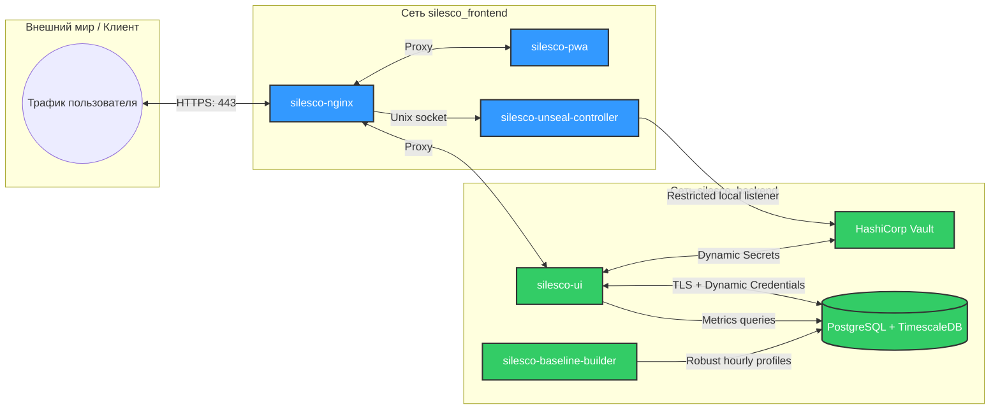

# Silesco.io — Модуль 2. Инфраструктура Master-ноды

**Лицензия документа:** CC BY 4.0; runtime лицензируется отдельно
**Репозиторий:** GitLab
**Дата:** 2026
**Версия архитектурного baseline:** 1.19.1 (не версия продукта)

---

## 1. Сетевая топология Docker (Docker Network Policy)

Для минимизации векторов атак на Master-ноде реализована строгая изоляция служебных контейнеров с разделением обязанностей [4]. Вместо объединения всех сервисов в одну общую сеть, инфраструктура разбита на три независимые Docker-сети [4]:

| Сеть | Назначение | Подключённые контейнеры |
|---|---|---|
| `silesco_frontend` | Обслуживание внешнего трафика, терминирование TLS и отдача статики | `silesco-nginx`, `silesco-ui` (web), `silesco-pwa` [3] |
| `silesco_backend` | Внутренний контур обработки данных и хранения секретов | `silesco-ui` (API), `silesco-pgsql`, `silesco-vault`, `silesco-baseline-builder` [3, 4] |
| `silesco_vault_init` / `silesco_vault_setup` / `silesco_vault_recovery` (временные, взаимоисключающие) | `PREINIT`, `POSTINIT_SEALED_SETUP` либо explicit `RECOVERY_SETUP` на том же Raft volume | Vault + ровно один digest-pinned init/setup/recovery worker; PostgreSQL временно входит только в setup contour до permanent TLS proof; ordinary listeners отсутствуют |
| `silesco_monitoring` (опционально) | Дополнительная расширенная эксплуатационная диагностика | `silesco-prometheus`, `silesco-grafana`, `node-exporter`; не требуются для базового container observability |

`silesco_backend` является отдельной user-defined bridge с закрытым membership и без неявных host publications, но не создаётся с Docker-флагом `--internal`. Флаг `--internal` блокирует нормативную loopback-публикацию PostgreSQL для host-native Collector, а UI нужны контролируемые исходящие соединения. Вход с host/public появляется только через явный `ports:` из Deployment Plan; отсутствие такого mapping сохраняет container-only listener закрытым.

---

## 2. Спецификации сервисов Master-ноды

Master является управляемой нодой и использует локальные профили `silesco-agent-core`, `silesco-agent-guard`, `silesco-agent-observer`, Collector и Backup. Те же privilege boundaries сохраняются: UI не получает Docker socket/root, observer изолирован отдельным пользователем группы `docker`, Guard вызывает только root-owned helpers. Локальные компоненты не создают искусственный WireGuard loop. Core/Guard Master используют direct loopback-only mTLS Agent API `127.0.0.1:29371`; удалённые Agent используют тот же application listener через exact Master WireGuard bind `:27931`. Yii3 Agent API сам терминирует mTLS и выводит `node_id/component` из проверенного certificate, поэтому Nginx и caller-supplied identity headers в этом пути отсутствуют.

Permit signing отделён от публичного UI HTTP: отдельный непубличный Yii3 worker сверяет durable authorization и вызывает только exact Vault Transit sign path. Root helpers используют local monotonic trust projection ADR-071; ни UI route, ни Guard task не могут передать им другой public key, issuer или trust path.

### 2.1. `silesco-nginx`
* **Роль:** Единственная точка внешнего входа (Reverse Proxy), терминирующая публичный TLS [3].
* Используется официальный образ Nginx, закреплённый по digest. Silesco не собирает собственный образ и не заменяет Nginx сервисом на Rust.
* Один экземпляр/контур ingress обслуживает как control plane Silesco, так и разрешённые пользовательские приложения. Дополнительные публичные reverse-proxy точки не создаются: CrowdSec анализирует журналы единого Nginx.
* Конфигурация является производным артефактом Deployment Plan. `silesco-helper-apply-deployment` выполняет `nginx -t`, атомарную замену, graceful reload и rollback; отдельный helper только для Nginx не создаётся.
* **Политика безопасности:**
  * Доступ ко всем внутренним эндпоинтам (кроме `/health` и ACME HTTP-01) закрыт и требует авторизации.
  * **Rate Limiting:**
    * все `POST /bootstrap/v1/pwa/*` routes имеют отдельные bounded body/TTL/replay limits;
    * `POST /bootstrap/v1/unseal` — максимум 3 попытки в 15 минут; route `/vault/unseal` отсутствует.
    * `/auth/*` — 10 запросов в минуту.
    * `/guard/*` — 5 запросов в 5 минут.
    * Остальные базовые эндпоинты API — 60 запросов в минуту.
  * Nginx не соединяется с Vault API. Единственный интерактивный unseal route передаётся по Unix socket в `silesco-unseal-controller` с запретом request-body logging.

### 2.2. `silesco-unseal-controller`
* **Роль:** Минимальный постоянный pre-Vault controller интерактивного PWA-unseal; не является частью Yii3 UI или временного Wizard.
* **Вход:** Только exact allowlist через root-managed Unix socket Nginx: `POST /bootstrap/v1/pwa/enrollments/prepare`, `POST /bootstrap/v1/pwa/enrollments/{id}/registration`, `POST /bootstrap/v1/pwa/enrollments/{id}/commit`, `POST /bootstrap/v1/pwa/enrollments/{id}/abort`, существующий `POST /bootstrap/v1/pwa/handoffs/{handoff_id}/completion` только для terminal readback, `POST /bootstrap/v1/pwa/challenges` и `POST /bootstrap/v1/unseal`. Публичного TCP listener и произвольного suffix routing нет; Nginx route set не расширяется caller-selected путём.
* **Проверки:** Bounded body, Origin, одноразовый server challenge, WebAuthn assertion зарегистрированного credential, TTL, rate limit и replay state.
* **Выход:** Единственная фиксированная операция `https://127.0.0.1:30741/v1/sys/unseal`; exact loopback Docker publication ведёт к Vault bootstrap listener `8202/tcp` и требует TLS 1.3 + Controller-only mTLS. Остальные Vault paths, caller-selected endpoint и произвольный proxy запрещены.
* **Unix identity:** Socket directory принадлежит `silesco-unseal:silesco-bootstrap` и даёт группе только traversal; socket `0660`. Nginx получает supplemental numeric GID `silesco-bootstrap` через Compose, но не identity Controller и не доступ к его state/credentials.
* **Состояние:** Только public credential records, закрытые enrollment terminal states, anti-replay metadata и durable root outbox вне Vault/PostgreSQL; share обрабатывается в памяти и не логируется. Browser никогда не пишет committed completion. Один Controller commit атомарно связывает IndexedDB evidence, активирует credential, создаёт Protocol completion и outbox; initial `L+P` ждёт root ack. После uncertain commit browser выполняет только `/completion` terminal readback, не replay commit/abort.
* **Права:** Отдельный непривилегированный пользователь, без Docker socket/sudo и без общего Vault token.

### 2.3. `silesco-baseline-builder`
* **Роль:** Периодически строит из TimescaleDB исторические robust-профили контейнерных метрик по часу недели.
* **Форма реализации:** TimescaleDB continuous aggregates/SQL выполняют агрегацию; Yii3 worker версионирует, подписывает и публикует готовую модель. Отдельный Rust-демон не создаётся.
* **Правила безопасности:**
  * Не имеет Docker socket и не управляет контейнерами.
  * Читает только агрегированные временные ряды и записывает версионированные baseline-модели.
  * Master подписывает модель и доставляет её соответствующему Core через Agent API; Core проверяет scope, версию, срок действия и подпись.
  * Недоступность builder не останавливает сбор: Core продолжает работать по последней допустимой модели и локальному rolling baseline.

### 2.4. `silesco-pgsql` (База данных системных логов и конфигураций)
* **Технологический стек:** СУБД PostgreSQL 16 с расширением TimescaleDB для эффективной работы с временными рядами.
* Используется upstream `timescale/timescaledb` image с конкретной совместимой парой версий PostgreSQL/TimescaleDB и digest; собственный database image Silesco не собирается. Плавающие теги `latest-pg*` запрещены в release manifest.
* **Правила безопасности:**
  * Контейнер подключён только к закрытой сети `silesco_backend` [4].
  * Порт СУБД не публикуется на внешнем интерфейсе или WireGuard. Единственный host-native Collector на Master использует зарегистрированный loopback-only mapping `127.0.0.1:28643 → 5432` с PostgreSQL TLS, client certificate и ролью только для `EXECUTE` ingest-функции; точный контракт находится в `22_postgresql_contract.md`.
  * Авторизация веб-панели и служб Silesco происходит исключительно через временные динамические секреты Vault Database Secrets Engine. Generic runtime policy может использовать TTL 1 час, но disposable migration/backup/restore roles подчиняются более точной таблице `22_postgresql_contract.md` (`900/3600`, `3600/14400`, `900/900` секунд default/max); component/job сам определяет необходимость renewal в пределах `max_ttl`.
  * Collector дополнительно проходит проверку client certificate и получает отдельную роль без прямых прав на таблицы — только `EXECUTE` ingest-функции.
* **Правила ротации и хранения (Retention Policy):**
  * Для хранения событий безопасности (CrowdSec блоги атак) и системного аудита (`audit_log`) используются TimescaleDB hypertables.
  * Срок хранения событий CrowdSec (`crowdsec_events`): 90 дней.
  * Срок хранения системного аудита (`audit_log`): 365 дней.
  * **Инвариант сжатия:** данные в hypertables старше 7 дней подвергаются автоматическому сжатию (TimescaleDB compression policy) для экономии дискового пространства хоста.
* **Проверка состояния (Health Check):** `pg_isready -U silesco_system -d silesco_db` [3].

### 2.5. Command Outbox и Agent API
* **Роль:** Хранение команд и надёжная доставка Agent-нодам без отдельного Redis-брокера в первой версии.
* **Listener matrix:** один Agent API workload принимает TLS 1.3/mTLS на container-only upstream и публикуется только двумя exact host tuples: `127.0.0.1:29371/tcp` для Master-local Core/Guard и `<master-tunnel-ip>:27931/tcp` для удалённых Agent. Wildcard/public binds и plaintext loopback запрещены. Эти два маршрута используют одинаковые schema, authorization, revocation и replay rules.
* **Identity boundary:** TLS завершается в Agent API workload. Nginx не проксирует Agent API и не формирует `X-Client-*`/certificate headers; payload `node_id` не заменяет certificate identity.
* Команда и outbox-запись создаются в одной транзакции PostgreSQL с изменением desired state.
* Agent-нода сама устанавливает исходящее mTLS-соединение к Agent API и получает доступные ей команды через long polling или длительное HTTP-соединение.
* Команда содержит `command_id`, `generation`, `idempotency_key`, типизированный payload и при необходимости подписанный Execution Permit.
* Результат сохраняется в PostgreSQL до подтверждения доставки UI. Повторная доставка не должна повторно применять мутацию.
* Redis может быть добавлен в будущем только как внутренняя оптимизация Master без изменения внешнего Agent protocol.

Agent API также владеет Master-side частью ADR-048:

* одноразовый public bootstrap endpoint принимает capability и temporary WireGuard public key до создания временного peer; после atomic claim raw capability повторно не принимается;
* enrollment session, certificate renewal и WireGuard rotation имеют независимые PostgreSQL state machines и replay/idempotency records;
* Yii3 является узким Vault PKI broker: проверяет session либо действующую `node_id/component` mTLS identity и вызывает раздельные sign roles Core/Guard; Agent не получает произвольный PKI token;
* старый certificate serial отзывается только после durable activation result, подтверждённого фактически новым mTLS-соединением;
* автоматический WireGuard maintenance Permit подписывается только для canonical exact plan hash и не разрешает изменение stable tunnel address, AllowedIPs/topology или Master trust anchor.

### 2.6. Центральный CrowdSec LAPI

* Master размещает центральный host CrowdSec LAPI, доступный Agent Log Processors и bouncers только через WireGuard и обязательный mTLS. LAPI использует `RequireAndVerifyClientCert`, отдельные OU для Agent и bouncer и CRL; password/API-key credential не смешивается с client certificate.
* Log Processors отправляют alerts, LAPI создаёт bounded decisions по профилям, bouncers опрашивают решения и применяют их на локальных host firewalls.
* Автоматические блокировки до 24 часов заранее разрешены security policy и не создают PWA challenge на каждый IP. Permanent/manual decisions и изменение policy используют обычный Execution Permit.
* Недоступность LAPI не останавливает пользовательские приложения, но отображается как degraded security. Upstream-очередь Log Processor хранится в памяти и теряется при его рестарте во время outage, поэтому lossless delivery до отдельного durable replay-контракта не обещается. Единственный Collector работает на Master и читает LAPI локально; административный Collector credential не распространяется на Agent-ноды.

### 2.7. `silesco-ui` (Бэкенд управления)
* **Технологический стек:** PHP 8.3 + фреймворк Yii3 (с включенным строгим режимом `strict_types=1` и использованием DI-контейнеров).
* **Взаимодействие:**
  * Генерирует докер-манифесты и конфигурационные файлы.
  * Обрабатывает SAM-манифест и пользовательские параметры, формируя Deployment Plan, resolved compose specification и ссылки на секреты. Физические файлы на Agent-нode создаёт Guard.
  * Сохраняет команды в PostgreSQL outbox и выдаёт их через Agent API.
  * Проверяет соответствие версий API при обработке запросов от Агентов [4].

---

## 3. Bootstrap-алгоритм старта инфраструктуры

Поскольку Yii3 требует подключения к БД, а БД недоступна до тех пор, пока Vault заблокирован (так как нет прав на создание dynamic secrets) [1], запуск Master-ноды происходит в холодном изолированном режиме [3]:

1. **Bootstrap host:** Oneline-инсталлятор устанавливает пакеты, Docker, системных пользователей и минимальные конфигурации.
2. **Bootstrap web (ADR-091):** Installer спрашивает базовый домен и выбирает пригодный wildcard `install.<domain>` либо IP-вход. Стартуют официальный Nginx и временный непривилегированный PHP/Yii3 bootstrap container. Runtime/модули общие с панелью, но bootstrap не зависит от готовых PostgreSQL/Vault и не запускает все UI workers. Installer генерирует self-signed сертификат и одноразовый token; LE сертификаты на этом этапе не выпускаются. Nginx проксирует к exact Unix socket Wizard. Root-owned systemd lifecycle управляет контейнером, apply и timeout; PHP не получает Docker socket/sudo. После проверки готовности Installer печатает кликабельный URL/fingerprint и возвращает shell prompt. Постоянный Unseal Controller остаётся отдельным host-native компонентом. Полный целевой сценарий — модуль24.
3. **Первое подключение:** CLI выводит `https://IP/<bootstrap-token>` и fingerprint сертификата. Первое успешное погашение token атомарно закрывает ссылку для других клиентов и создаёт единственную Wizard session.
   * Сессия получает `Secure`, `HttpOnly`, `SameSite=Strict` cookie и отдельную CSRF-защиту.
   * Сервер сохраняет hash session ID, исходный IP и ограниченную диагностическую metadata браузера. Нужны одновременно cookie и совпадение IP.
   * Cookie позволяет тому же браузеру переподключаться; «одно подключение» означает одну привязанную браузерную сессию, а не один TCP-сеанс.
   * Абсолютный TTL Wizard — 2 часа, idle timeout — 30 минут. После истечения требуется перезапуск bootstrap.
   * Погашение token выполняется атомарной compare-and-swap операцией в локальном root-only bootstrap state. После успеха сервер отвечает `303` на чистый `/wizard`, чтобы token не оставался в последующих URL.
   * Bootstrap-страницы задают `Referrer-Policy: no-referrer`, строгий CSP и не загружают сторонние ресурсы. Nginx не записывает bootstrap-token в access log.
   * Для привязки используется фактический `remote_addr`; недоверенный `X-Forwarded-For` игнорируется.
4. **Wizard:** Пользователь задаёт домены, ACME HTTP-01/DNS-01, Vault/KMS, хранилище, recovery и остальные параметры. Для панели Wizard предлагает `ui.<основной-домен>` и позволяет выбрать другой валидный hostname, но не занимает apex по умолчанию. Он явно предупреждает: `ui`, `admin`, `panel`, случайная метка или смена URL не скрывают точку входа и не заменяют аутентификацию, rate limiting и сетевые политики. Wizard выполняет `fsync` и atomic rename типизированного handoff; `silesco-bootstrap-apply.path` запускает root oneshot. Root-процесс повторно валидирует ввод, пишет journal компенсирующих действий и публикует Wizard только санитизированный progress.
   * Первичный Vault init выполняет отдельный root-owned oneshot, а не Wizard/Controller. После executable host-bound systemd credential probe он создаёт временную `silesco_vault_init`, подключает одноразовый init-client и Vault listener `32417/tcp` без host publication. После init pre-init profile останавливается; sealed setup profile с новой CA/identity использует тот же Raft volume, Controller-only `30741` unseal projection и Vault-owned closed setup manifest. Host-native setup worker не использует эту loopback-проекцию: Installer сверяет exact `silesco-vault-setup`/`vault-setup` container, network/IP/netns identity, передаёт уже открытый netns FD, а worker выполняет `setns` и соединяется с pinned container IP:`32417` при TLS hostname/SNI `silesco-vault`. Initial Root token revoke и два denial proofs обязательны до permanent profile.
5. **Trusted TLS:** `silesco-acme` получает сертификат. Сертификат и приватный ключ Nginx хранятся на хосте вне Vault, чтобы HTTPS и PWA были доступны до unseal. PWA route и QR/восьмизначный pairing code активируются только после успешной проверки canonical HTTPS origin; self-signed Wizard origin для настройки телефона не используется.
   * Ingress generation переходит `bootstrap → trusted-enrollment`: canonical LE listener сохраняет exact Wizard socket, добавляет static PWA и узкие Controller routes, но ещё не публикует UI.
6. **Data services:** PostgreSQL сначала получает transaction bootstrap server TLS и private setup contour; затем стартует sealed Vault setup profile. Initial unseal — `L+K` при typed KMS adapter→Controller delivery либо `L+P` через PWA/Controller; `R` — recovery fallback. Setup infrastructure PKI подписывает permanent PostgreSQL CSR и завершает первый worker после передачи canonical package. Installer durable сохраняет package, PostgreSQL owner атомарно применяет generation и выдаёт byte-bound acknowledgement; только новый bounded worker delivery с теми же transaction/ciphertext/setup generation, но fresh UUID/nonce, настраивает Database Engine через `verify-full` + inline public `tls_ca`. Permanent Vault topology запускается на том же volume только после exact setup generation/hash, Root-token revoke и cleanup proofs.
7. **Infrastructure schema:** После unseal одноразовый pinned `psql` job получает краткоживущую migration role через Vault Agent, берёт advisory lock и применяет только подписанный infrastructure bundle `silesco-postgresql`. Guard оркестрирует helper, но не получает database credential.
8. **Control plane:** UI получает Dynamic Credentials PostgreSQL, проверяет допустимую infrastructure schema version, применяет отдельные Yii3 business migrations и запускает Agent API, baseline builder и остальные разрешённые службы. Collector запускается только после готовности loopback+mTLS ingest contract.
9. **Bootstrap cleanup:** После атомарного commit `configured` Nginx переключается с `trusted-enrollment` на generation без Wizard route/mount и с UI catch-all. Wizard отдаёт финальный результат. Browser acknowledgement или bounded timeout разрешает root cleanup остановить временный bootstrap container и удалить его socket, draft/session/token, identity и units. Общие PHP image/модули панели не удаляются. PHP не обладает правом самоудаления или управления Docker; authoritative state остаётся bootstrap journal.

Повторный installer читает journal: `configured` переводит в status/repair; `wizard_active` показывает действующий URL и не создаёт вторую сессию; `expired/failed` останавливает старый контур, выполняет rollback обратимых изменений и только затем создаёт новый сертификат/token/URL. Внешние необратимые действия пользователя, например ручная DNS-запись, только перечисляются в отчёте и не удаляются автоматически.
