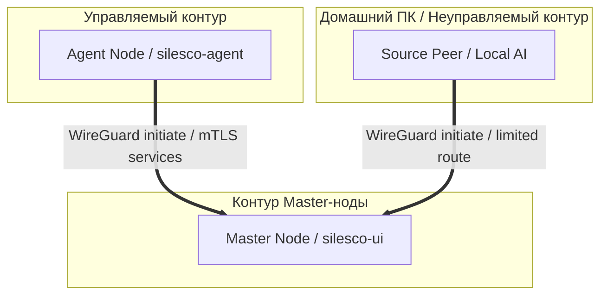

# Silesco.io — Модуль 4. Сетевая связность и Пиры

**Лицензия документа:** CC BY 4.0; runtime лицензируется отдельно
**Репозитории:** GitHub organization `Silesco-io`
**Дата:** 2026
**Версия архитектурного baseline:** 1.7.0 (не версия продукта)

---

## 1. Топология сети WireGuard и контур безопасности

Вся межнодовая коммуникация в Silesco.io организована поверх защищённой виртуальной сети WireGuard [2, 4]. Пул адресов изолирован от внешней сети интернет.

### 1.1. Классификация подключений (Пиров):
1. **Master ← Agent-нода:** Agent всегда инициирует WireGuard-соединение к Master. Внутри туннеля работают Agent API/mTLS, отдельный Vault listener и исходящая доставка телеметрии; Docker monitor не открывает сетевой listener.
2. **Master ←→ Source-пир:** Однонаправленное подключение только для проброса портов [4]. На Source-пирах (например, домашнем ПК пользователя) не устанавливаются системные агенты Silesco [4].
3. **silesco-notifier → Source-пир:** Возможный ограниченный транзитный канал к локальным ИИ-моделям (LM Studio / Ollama). Точный endpoint задаётся provider contract и не получает заранее hardcoded port до отдельного решения.



---

## 2. Спецификации межнодовой защиты и mTLS (SEC-03)

WireGuard является обязательным host-native L3 transport. Дополнительный mTLS применяется по типу сервиса, а не автоматически ко всему трафику внутри туннеля:
* В качестве единого локального удостоверяющего центра (Certificate Authority) выступает внутренний Secrets Engine PKI в HashiCorp Vault на Master-ноде [2, 4].
* Векторы mTLS-взаимодействия внутри туннеля распределены следующим образом [4]:
  * Agent API ←→ `silesco-agent-core` [4]
  * Agent API ←→ `silesco-agent-guard` [4]
  * Vault Agent listener ←→ разрешённые Agent identities;
  * central CrowdSec LAPI ←→ Agent Log Processors/bouncers.

Master Nginx → Agent Nginx application ingress первой версии не использует TLS поверх WireGuard. Это bounded исключение ADR-050: listener доступен только на Agent tunnel IP, только от точного Master tunnel IP и не содержит control-plane routes. Возможный независимый Nginx mTLS profile резервируется для будущей Ultimate-редакции.

### 2.1. Механизм мгновенного отзыва (Quarantine Policy):
При переводе Agent-ноды в карантин (через UI или при фиксации атаки на Master) выполняется автоматический отзыв её сертификатов [4]:
1. Master-нода вносит серийный номер скомпрометированного сертификата в список отзыва — **CRL (Certificate Revocation List)** [4].
2. Локальный CRL-список синхронизируется на всех компонентах системы [4].
3. Все узлы проекта обязаны проверять CRL-список при каждой попытке установления mTLS-соединения [4]. Нарушение проверки — немедленный разрыв сетевой сессии.

---

## 3. Матрица правил фаервола (UFW Policy)

Для минимизации площади атак каждый хост настраивается по правилу «закрыто всё, что явно не разрешено».

### 3.1. Master-нода (Минимальный внешний профиль) [4]:
* `22/tcp` — Служба SSH. Доступна внешне [4]. Если порт открыт для всего мира (`0.0.0.0/0`), веб-интерфейс `silesco-ui` постоянно отображает предупреждение: *«SSH доступен без ограничения по IP. Рекомендуется ограничить доступ конкретными адресами в UFW»* [4].
* `80/tcp` — HTTP. Открыт исключительно для прохождения валидации ACME HTTP-01 challenge [1, 4]. Все остальные запросы принудительно перенаправляются на HTTPS.
* `443/tcp` — HTTPS. Внешний порт веб-сервера `silesco-nginx` [4].
* `31946/udp` — предлагаемый Wizard default для публичного host WireGuard endpoint Master. Пользователь может выбрать другой UDP port после обязательной проверки конфликта; endpoint не является identity.
* PostgreSQL/Vault service ports не открываются на публичном интерфейсе. Они слушают только WireGuard/internal адреса и фильтруются по source identity/address внутри туннеля.

### 3.2. Agent-нода (Базовый профиль управляемого хоста) [4]:
* Входящий public WireGuard-port не открывается. Host WireGuard использует исходящее соединение к выбранному endpoint Master и при необходимости `PersistentKeepalive`.
* Компонент наблюдения Docker не слушает TCP-порт. Core отправляет metrics/anomaly batches по исходящему Agent API/mTLS-соединению. На удалённом Agent это `<master-tunnel-ip>:27931`; Master-local профиль использует `127.0.0.1:29371` без искусственного WireGuard loop. Оба exact binds завершают TLS в одном Yii3 Agent API workload и применяют одинаковую certificate identity/revocation policy; plaintext loopback и Nginx identity headers запрещены.
* Agent Nginx по умолчанию имеет только `http://<agent-tunnel-ip>:26783` listener. UFW/routes допускают к нему лишь точный Master tunnel IP; Public Silesco UI/Vault/Wizard на Agent отсутствуют.
* По явному Deployment Plan Agent может получить public Nginx ingress. Общие `80/443` и дополнительные listeners разрешены типизированными endpoints; несколько HTTPS-приложений используют один `443` по SNI/Host. Публичный порт не назначается каждому приложению автоматически.
* **Правило динамических портов:** Все публичные TCP/UDP-порты приложений по умолчанию закрыты. Guard открывает только точный набор из подтверждённого Deployment Plan; UI заранее обнаруживает конфликт tuple `{namespace, transport, address, port}`. Docker `ports:`, `-P`, wildcard bind и случайный fallback без плана запрещены.
* Автоматические CrowdSec decisions сроком не более 24 часов являются отдельной заранее включённой remediation policy и применяются host bouncer без интерактивного PWA-confirmation. Изменение policy, permanent ban или более долгий срок проходит обычный Guard/Execution Permit flow.

### 3.3. Public Agent ingress и доменные зоны

Поддомены основного registrable domain установки могут указывать непосредственно на Agent и обслуживаться его Nginx без Ultimate. Независимые registrable domains коммерчески обслуживаемых организаций требуют одноразового Ultimate Authorization Token по ADR-041; произвольный дополнительный порт существующего домена не создаёт это требование.

Центральный `silesco-acme` оркестрирует issuance/renewal, но private key штатно генерируется на целевой Agent и не покидает её. Master получает CSR и возвращает certificate chain. Копирование общего wildcard/SAN private key с Master разрешено только как предупреждаемая PRO-опция; local `acme.sh` на Agent нужен лишь для выбранного автономного issuance.

### 3.4. CrowdSec distributed control plane

Agent Log Processor отправляет alerts в центральный LAPI Master по WireGuard/TLS с machine identity. Agent bouncer получает decisions из того же LAPI и применяет блокировку на локальном host firewall. Недоступность LAPI не останавливает приложения, но отображается как degraded security, поскольку новые центральные решения временно не поступают.

---

## 4. Спецификации Source-пиров (AI-транзит)

Source-пиры позволяют пользователям гибко и безболезненно использовать ресурсы своих мощных домашних ПК (например, видеокарты для локальных нейросетей) в облачной экосистеме без раскрытия их реальных IP-адресов [4].

### Алгоритм подключения Source-пира:
1. Пользователь запрашивает добавление пира в интерфейсе Silesco.io.
2. Панель генерирует стандартный файл конфигурации WireGuard (`.conf`) с endpoint Master и только явно разрешёнными provider routes. Точный порт локальной ИИ-службы определяется отдельным provider contract, а не глобальным hardcode.
3. На домашнем ПК запускается стандартный WireGuard-клиент [4].
4. `silesco-agent-notifier` на Master обращается только к разрешённому tunnel endpoint provider-а; отсутствие Source-пира переводит функцию в degraded/unavailable, но не затрагивает серверный control plane.

---

## 5. Стабильная identity и смена endpoint

Node identity не зависит от публичного IP. Agent хранит `master_id`, доверенный CA/public key и основной DNS endpoint. Смена IP Master при сохранении DNS и identity прозрачна для Agent. Постоянный WireGuard tunnel address также не меняется при штатной ротации WireGuard key либо mTLS certificate.

### 4.1. Installation address plan

Для новой установки Wizard предлагает IPv4 pool `10.73.0.0/16`: Master получает `10.73.0.1`, Agent addresses начинаются с `10.73.0.2` и применяются как exact peer `/32`. Параллельно Installer генерирует random RFC 4193 ULA `/64`, сохраняет его в installation desired state, назначает Master `::1/128`, а Agent — stable `/128`.

До любой host mutation Wizard/Installer проверяет пересечение с host routes, directly connected networks, Docker networks, другими WireGuard interfaces и уже зарегистрированным desired state. При конфликте random fallback или автоматический выбор другого пула запрещён: UI показывает понятное объяснение и предлагает ввести другой private IPv4 CIDR; ULA перегерируется до apply. Address plan входит в signed installation/deployment state, но не является identity.

Если DNS потерян или endpoint требуется заменить аварийно, root выполняет локальную команду вида:

```bash
silesco-agent rebind-master --endpoint new-master.example:31946
```

Номер в примере является default, а не обязательным значением. Команда меняет endpoint, но не доверенную identity. Замена CA/fingerprint требует отдельной recovery-процедуры.

При восстановлении Agent на другом сервере изменение IP допустимо. Master выдаёт одноразовый recovery token, отзывает или карантинирует старую identity и привязывает логическую ноду к новой паре ключей. Одновременная работа старой и восстановленной identity запрещена.

---

## 6. Независимые cryptographic identities

WireGuard и mTLS не используют общий key lifecycle:

| Контур | Ключи и issuer | Назначение | Механизм отзыва |
|---|---|---|---|
| WireGuard | Локальная Curve25519 private/public keypair; CA/CSR/X.509 отсутствуют | Закрытый L3 transport и cryptokey routing | Удаление/замена public key peer в Master и authoritative registry |
| Core mTLS | Отдельная local private key и CSR; leaf подписывает Vault Master PKI | `node_id + component=core` identity Agent API | Vault PKI revoke, CRL/OCSP и немедленное deny старого serial в Agent API |
| Guard mTLS | Отдельная local private key и CSR; leaf подписывает Vault Master PKI | `node_id + component=guard` identity mutation channel | Vault PKI revoke, CRL/OCSP и немедленное deny старого serial в Agent API |

WireGuard private keys, Core/Guard private keys и временные enrollment private keys никогда не передаются Master, не входят в protocol payload, PostgreSQL, audit или logs. Yii3 Agent API является единственным broker для issuance: он проверяет enrollment session или действующую component identity и вызывает узкую Vault PKI sign role. Agent не получает token, позволяющий произвольно вызывать PKI sign/revoke.

## 7. Canonical Agent enrollment state machine

Основной граф:

```text
created
→ awaiting_connection
→ bootstrap_connected
→ awaiting_confirmation
→ approved
→ credentials_pending
→ package_issued
→ applying
→ verifying
→ enrolled
```

Отказы:

```text
awaiting_connection → expired
bootstrap_connected | awaiting_confirmation → rejected | expired
credentials_pending | package_issued | applying | verifying → apply_failed
apply_failed → retrying | rolled_back | expired
```

Нормативные правила:

1. UI заранее создаёт логическую запись ноды в PostgreSQL и enrollment session в `awaiting_connection`.
2. Одноразовая installation-scoped capability имеет TTL один час, привязана к `enrollment_session_id`, `installation_id` и `node_id`, хранится только как digest и защищена nonce/replay state. Долговременных credentials в ней нет.
3. Installer локально создаёт временную WireGuard keypair. Private key ноду не покидает.
4. До создания временного peer Core выполняет единственный server-authenticated HTTPS bootstrap claim: передаёт raw capability, temporary WireGuard public key/fingerprint и bounded host facts. Master не может принять WireGuard peer до получения public key. TLS endpoint и Master WireGuard key берутся из подписанного installer/bootstrap payload; endpoint/IP сами по себе identity не являются.
5. Успешный claim атомарно погашает raw capability, связывает session с temporary public key и возвращает подписанную временную peer configuration. Повтор raw capability запрещён; последующие retry используют уже связанную bootstrap session.
6. После temporary WireGuard handshake состояние становится `bootstrap_connected`; дальнейшие CSR/package операции выполняются только через временный туннель и server-authenticated Agent API.
7. UI показывает fingerprint и host facts, затем переводит session в `awaiting_confirmation`. До подтверждения permanent WireGuard trust, Vault/AppRole credentials и mTLS certificates не выдаются.
8. После подтверждения состояние `approved` разрешает одну bounded compound operation. Guard получает signed preparation authorization, а apply-wireguard helper локально создаёт staged permanent WireGuard private/public keypair и возвращает только public key. Core и Guard независимо создают собственные mTLS private keys и CSR; private key Guard Core не читает.
9. Core передаёт permanent WireGuard public key и оба CSR через temporary tunnel. Yii3 проверяет session и вызывает отдельные узкие Vault PKI roles для Core/Guard. Vault получает CSR, но не Agent private keys.
10. Master формирует immutable signed enrollment package, связанный как минимум с `enrollment_session_id`, `node_id`, `installation_id`, temporary/permanent WireGuard public keys, stable tunnel address, Master endpoint/public key, Core/Guard CSR digests, certificate serials, package hash, idempotency key, nonce, `issued_at`, `not_before` и `expires_at`.
11. Для точного package hash Master выпускает Execution Permit под уже approved enrollment session. Второе пользовательское подтверждение неизменённого package не требуется.
12. Guard и helper независимо проверяют package signature, Permit, identities, hashes, TTL, nonce и replay journal. Helper создаёт root-owned generation, выполняет `fsync` и staged activation.
13. В `verifying` Core и Guard доказывают permanent WireGuard handshake, сохранение stable tunnel address, новые mTLS Agent API channels и соответствие certificate identity целевым `node_id/component`.
14. Commit boundary — durable запись active WireGuard key version и обоих active certificate serials в PostgreSQL после успешного authenticated proof. Только затем удаляются bootstrap peer, raw session material и temporary private key.
15. До commit ошибка удаляет staged generation либо возвращает прежнюю active generation; temporary tunnel может жить до неизменного package expiry. Идемпотентный retry разрешён только для того же package hash/idempotency key.
16. Изменение CSR/public key/package payload либо expiry требует новой enrollment session и нового пользовательского подтверждения.
17. Master обеспечивает single-active-identity invariant: старая и восстановленная identity одной логической ноды одновременно не принимаются.

## 8. Canonical mTLS certificate renewal

Основной граф:

```text
active
→ renewal_due
→ csr_created
→ certificate_issued
→ staged
→ verifying
→ activated
→ old_certificate_revoking
→ completed
```

Отказы:

```text
csr_created | certificate_issued | staged | verifying
→ renewal_failed
→ retry_scheduled | rolled_back

activated | old_certificate_revoking
→ revocation_pending | completed
```

Правила:

1. Core и Guard выполняют lifecycle независимо и владеют разными private keys/certificates.
2. Initial Master policy v1 задаёт certificate TTL 30 дней и `renewal_due` за 5 дней до `not_after` с deterministic jitter `0..12h`. Policy version и рассчитанное `renew_at` доставляются компоненту; значения не hardcode-ятся в binary. Retry/backoff ограничен expiry и не продлевает certificate.
3. CSR передаётся по действующему WireGuard+mTLS channel в `agent.certificate.sign-request.v1`. Yii3 проверяет текущую node/component identity и вызывает только соответствующую Vault PKI sign role.
4. `agent.certificate.package.v1` содержит leaf certificate, CA chain, serial, validity, identity и binding к request/CSR digest, но не private key.
5. Новая generation устанавливается рядом со старой. До проверки `current` не переключается.
6. Компонент создаёт новое mTLS-соединение и отправляет `agent.certificate.activation-result.v1` с новым serial, `node_id`, component identity и request/rotation ID.
7. Commit boundary — Master по фактически аутентифицированному новому соединению durable помечает новый serial active и немедленно перестаёт выдавать mutation tasks/Permits старому serial. Только после этого локальный `current` становится новым.
8. Master отзывает старый serial в Vault PKI и обновляет CRL/OCSP state. При временной ошибке состояние `revocation_pending` допускает bounded retry; старый serial уже запрещён прикладным allowlist.
9. До activation ошибка оставляет старую generation active. После activation rollback на старый serial запрещён; восстанавливается новая identity либо выполняется recovery/re-enrollment.
10. Старые key/certificate files удаляются после подтверждённого отзыва и bounded overlap. При недоступном Master/Vault действующий сертификат используется до expiry, а renewal повторяется с bounded backoff.
11. Expired/revoked certificate не получает mutation task/Permit. Renewal не меняет WireGuard peer, tunnel address, Nginx routes или application configuration и не требует PWA/Execution Permit/root helper.

## 9. Canonical WireGuard key rotation

Основной граф:

```text
active
→ key_generated
→ plan_issued
→ staging
→ verifying
→ switching
→ overlap
→ completed
```

Отказы:

```text
staging | verifying | switching | overlap
→ rolling_back
→ rolled_back | rollback_failed
```

Правила:

1. Rotation выполняется реже certificate renewal: по Master policy, compromise suspicion, recovery/re-enrollment либо отдельному расписанию. Одновременно разрешена только одна rotation на ноду.
2. Master сначала выпускает typed maintenance preparation authorization, связанный с `rotation_id`, текущей key version и policy version. Guard вызывает apply-wireguard helper; helper создаёт staged keypair локально и возвращает только public key.
3. Core передаёт новый public key Master через действующий mTLS channel. Master формирует canonical signed rotation plan и автоматически выпускает короткоживущий Execution Permit с `authorization_source=maintenance_policy`, точным plan hash, TTL, nonce и idempotency key. PWA не требуется.
4. Permanent tunnel address, service AllowedIPs и Nginx upstream addresses не меняются.
5. Новый ключ сначала проверяется отдельным temporary control interface/route/address, не используемым приложениями. Два peer с одинаковыми permanent AllowedIPs на одном interface запрещены.
6. После handshake и authenticated control proof helper атомарно заменяет public key permanent peer на Master и active private-key generation на Agent.
7. После switch проверяются Agent API, Core/Guard mTLS и обязательные Master↔Agent routes.
8. `overlap` является bounded rollback window, а не одновременной активностью двух конфликтующих permanent peers: новый key active, старая generation сохранена root-only для автоматического возврата.
9. Commit boundary — durable successful route/mTLS verification и запись active key version в PostgreSQL. После commit старый public key удаляется из Master peer configuration/authoritative registry, а old private generation уничтожается после bounded cleanup.
10. При ошибке до commit восстанавливается предыдущая generation. `rollback_failed` переводит ноду в quarantine/recovery и не допускает бесконечного переключения.
11. Повтор идентичного plan идемпотентен; тот же `rotation_id`/idempotency key с другим payload отклоняется и аудитируется. CRL к WireGuard не применяется.
