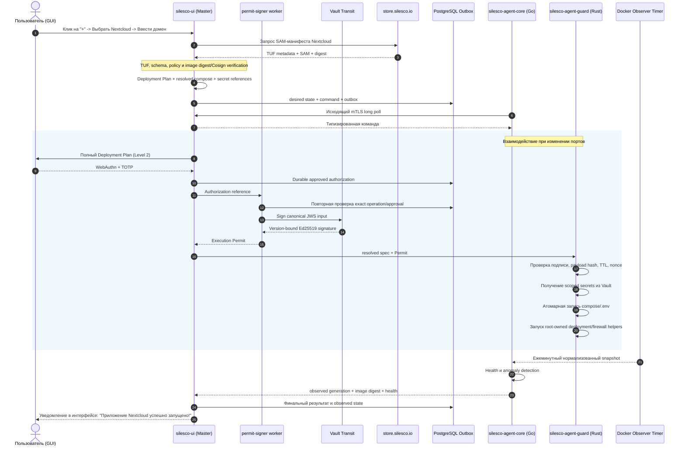
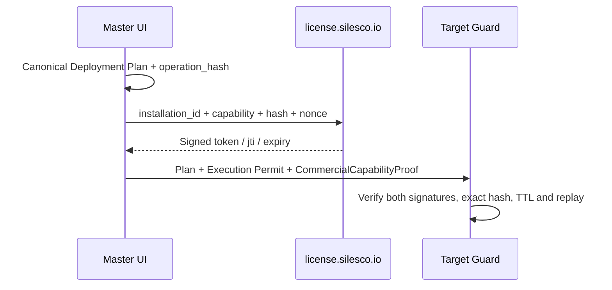

# Silesco.io — Модуль 6. Системные сценарии и обновления

**Лицензия документа:** CC BY 4.0; runtime лицензируется отдельно
**Репозитории:** GitHub organization `Silesco-io`
**Дата:** 2026
**Версия архитектурного baseline:** 1.23.0 (не версия продукта)

---

## 1. Сценарий 1: Первоначальный запуск системы (Bootstrap Process)

**Целевой runtime с 1.23.0:** ADR-091 и модуль24 заменяют host Go Wizard на
Yii3 bootstrap container с общими модулями панели. Начальный выбор install DNS/IP
выполняет Installer, ACME — только Wizard через типизированный executor.
Остальные trust/secret contracts ниже сохраняются. Старые service/executable
детали относятся к legacy profile до завершения нового clean-install gate.

Процесс развёртывания Master-ноды ориентирован на максимальную простоту установки для конечного пользователя, проходя в полуавтоматическом режиме через Oneline-инсталлятор [4].

### Пошаговый алгоритм установки:

### Переход browser session на canonical domain — ADR-090

Принято владельцем 2026-09-19: после активации выбранного адреса Wizard предлагает
«Продолжить на https://<выбранный-домен>» без повторного bootstrap token и потери
настроек. При совпадении исходного и выбранного host переход не требуется.
Этот flow не заменяет PWA handoff v2 и не передаёт Vault/KMS/recovery material.

1. До TLS switch Installer сохраняет ограниченную continuity projection для
   проверенного исходного bootstrap host/IP с прежним certificate. Nginx
   разрешает только необходимые Wizard readback/transition/static routes;
   PWA/KMS/Controller/recovery через source bridge запрещены. Catch-all для
   произвольных hosts не разрешён. Source binding проверяется root, а не
   принимается как произвольный server_name из browser payload.
2. Авторизованное readback сообщает target readiness отдельно от readiness
   текущего origin. Target выводится только из independently verified root TLS
   proof. Исходному host не выдаётся trustedOriginReady ради обхода.
3. Нажатие кнопки вызывает CSRF-protected prepare на source. Wizard связывает
   случайный 256-bit credential с installation ID, source session generation,
   exact source/target origins, client IP, TLS generation/fingerprint и HTTPS
   profile/CA context. В journal сохраняются только verifier и binding.
4. TTL=min(now+120s, current absolute deadline, current idle deadline,
   certificate notAfter). Одна pending operation на session. Same-origin
   request Origin/Host проверяется; target из browser не принимается.
5. Browser передаёт credential обычным HTTPS form POST на exact target claim
   route. Нет query/fragment, browser storage, clipboard, log или durable
   plaintext. No-store применяется везде. Только source HTML Wizard имеет
   Referrer-Policy: strict-origin: браузер передаёт scheme/host без path/query
   и сохраняет точный Origin form POST. No-referrer на source HTML приводит
   к Origin: null в Chromium и несовместим с обязательной source проверкой.
   API prepare/claim/confirm и target confirmation HTML сохраняют no-referrer.
   CSP form-action разрешает только exact independently verified target.
   Origin: null, общие Domain cookies и wildcard CORS запрещены.
6. Claim проверяет source Origin/IP, credential, deadlines и актуальный root
   proof, атомарно гасит credential и выдаёт provisional host-only Secure
   cookie+CSRF. Они разрешают только transition confirmation, не обычные
   mutation/PWA/KMS/recovery операции. Redirect ведёт на чистый target URL.
7. Target confirmation page делает same-origin POST с provisional cookie+CSRF;
   GET не выполняет мутацию. Confirm повторно проверяет binding/TLS/expiry и
   под store lock атомарно заменяет session hashes/generation. Source authority
   отзывается только здесь. Та же конфигурация остаётся в том же Wizard state.
8. После commit target открывает /wizard. Installer удаляет continuity
   projection по typed readback, либо завершает её по bounded expiry/cleanup.
   Пока root cleanup не завершён, source cookie уже не даёт authority.

Canonical state machine: `none → prepared → claimed → committed`;
`prepared/claimed → expired | invalidated`. До commit source session остаётся
действующей. Потеря prepare/claim response разрешает новую авторизованную source
операцию с invalidation старой; plaintext credential из journal не восстанавливается.
После потери confirm response те же уже полученные target cookies позволяют
идемпотентный confirm/readback без выдачи новых credentials. Replay claim после
consumption запрещён; параллельные вкладки сериализуются lock. Restart сохраняет
verifier/binding/state, но не секреты. Expiry всей установки, drift TLS/profile/CA,
смена source session либо IP закрывают переход без восстановления старой authority
после commit. Initial token и общий двухчасовой срок никогда не перевыпускаются.

Protocol фиксирует exact routes/schema names/HTTP mappings и negative fixtures;
legacy PWA handoff schemas неизменны. Acceptance включает реальные browser
IP→DNS, ui.domain→panel.domain, install.domain→panel.domain, same-host no-op,
lost responses/reload/two-tabs/replay/restart/expiry/TLS drift. Source continuity
проверяется после реального Nginx TLS switch. Alpha staging допускается только
по независимой policy ADR-088, production gates не ослабляются. Изменение уже
отправленного ACME domain — отдельный cancel/restart flow, не редактирование journal.

### Остальные обязательные bootstrap-контракты

**ADR-089, принято владельцем 2026-09-09:** PWA handoff v2 получает обязательный
типизированный HTTPS-контекст в binding. Обычный и alpha/le-staging-test режимы
не смешиваются; test сохраняет exact CA binding. Legacy handoff v1 и production
proof не изменяются. Protocol задаёт точные schemas/HTTP mapping и compatibility;
Wizard/Controller/PWA меняются совместно с Installer. Каждый root-policy consumer
независимо проверяет policy ADR-088, а browser только сохраняет/показывает
проверенный test status. Offer/delivery/completion/readback/persistence сохраняют
один контекст; смена policy/CA инвалидирует pending операции. Origin/RP/CSRF/TTL,
one-use P, Controller commit authority, recovery и native K delivery неизменны.
Нельзя включить новый flow только заменой reader в Wizard или подменой типа proof.

**Уточнение ADR-088, 2026-09-08, подтверждено владельцем:** описанный ниже
`io.silesco.bootstrap.trusted-origin/v1alpha1` остаётся только production proof
с прежним закрытым набором полей. Для явно тестовой alpha существует отдельная
schema `io.silesco.bootstrap.test-trusted-origin/v1alpha1`. Она использует тот же
путь, владельца, права, атомарную публикацию и ограничения чтения, но НЕ является
production proof и не принимается старым reader-ом.

Закрытый набор полей test proof: восемь прежних полей `schema`, `origin`,
`hostname`, `nginxGeneration`, `certificateSha256`, `notBeforeUnix`,
`notAfterUnix`, `verifiedAtUnix` и ровно три дополнительных: `releaseChannel`,
`deploymentProfile`, `caBundleSha256`. Значения первых двух дополнительных полей
строго `alpha` и `le-staging-test`; digest — 64 lowercase hex SHA-256 exact bytes
фиксированного staging CA bundle из проверенного установочного пакета. Остальные
типы/границы и проверка canonical DNS HTTPS, generation, fingerprint и validity
совпадают с production. Unknown/duplicate/trailing JSON запрещены.

Выбор reader-а производится по root-owned конфигурации, полученной из
проверенного подписанного deployment plan (или по ограниченному alpha-исключению
ниже), а не по schema/флагу самого proof,
HTTP-заголовку, browser payload или наличию CA-файла. Обычный профиль, release
и beta отвергают test schema. Test reader требует совпадения ожидаемых channel,
profile и CA digest с proof; неизвестный профиль закрывает операцию. Проверенный
test proof не преобразуется в legacy production record, включая промежуточные
проекции и результаты. Выходы Wizard/PWA/Installer сохраняют тестовый статус.

Publisher проверяет live TLS peer по canonical hostname/SNI, сроку и exact leaf
fingerprint с отдельным fixed CA bundle. Staging roots не добавляются в системное
хранилище и не используются для Yandex, get.silesco.io или иных внешних API.
Изменение profile/CA требует новой согласованной активации; pending proofs и
привязанные к ним незавершённые операции инвалидируются, а не переименовываются.
Rollback удаляет новый proof и возвращает согласованные PKI/Nginx generations
по прежним правилам. Legacy production parser и его тесты сохраняются.

**Исключение для тестовой alpha, подтверждено владельцем 2026-09-08
(baseline 1.20.2):** до реализации подписания deployment plan допускается
существующая цепочка проверки публикации по заранее заданному внешнему
SHA-256 publication index. Этот ожидаемый digest не берётся из скачанного
index, HTTP-ответа или формы Wizard. Проверенные index, closed manifest,
точные размеры/хеши и source-pinned Installer связывают установочный пакет.
Самостоятельная HTTPS policy входит в этот проверяемый пакет и явно содержит
`releaseChannel=alpha`, `deploymentProfile=le-staging-test` и
`caBundleSha256` exact fixed CA bundle. Installer проверяет всю цепочку до
публикации независимой root-owned policy для consumers. Одного `acmePolicy=staging`,
наличия CA-файла или полей proof недостаточно. Все потребители сверяют эту
policy, а не доверяют друг другу на слово. Подмена index/package/policy/CA
закрывает активацию; смена разрешённого набора требует новой согласованной
активации и инвалидирует прежние pending operations.
Это явно ограниченная alpha trust model, не цифровая подпись и не заявление
о реализованных TUF/Cosign. Для release, beta и обычного профиля исключение
не действует; production требования подписей сохранены. TLS get.silesco.io
и Yandex по-прежнему проверяется обычными roots.

Consumers обновляются совместно: Installer publisher/activation journal,
Wizard reader/readiness, root KMS admission, PWA binding/Vault preparation и
передаваемые Controller/PWA контексты. Каждый проверяющий test proof компонент
сверяет независимо полученную ожидаемую policy. Старые consumers безопасно
отказывают; mixed-version test installation не объявляется совместимой.
Это уточнение принятого ADR-088, не новый production trust anchor и не разрешение
отключать origin/RP/CSRF/capability/replay/deadline проверки.

1. **Запуск инсталлятора:** На Ubuntu и системах с настроенным `sudo` пользователь выполняет консольную команду на чистом сервере:
   ```bash
   curl -fsSL https://get.silesco.io | sudo bash
   ```
   На минимальном Debian `sudo` может отсутствовать. Тогда пользователь сначала входит в root-shell через `su -` и запускает `curl -fsSL https://get.silesco.io | bash`. Stage-0 принимает только `EUID=0`; непривилегированный запуск без доступного `sudo` завершается до любых изменений с точной инструкцией. Интерактивный `su` не встраивается в pipeline.
2. **Проверка системных требований:** Скрипт проверяет аппаратные ресурсы. Минимальный лимит для Master-ноды: 2 CPU, 2 GB RAM, 40 GB SSD. При несоответствии инсталлятор выдает предупреждение, но не блокирует установку, если пользователь согласен на риск.
3. **Окружение Docker:** Скрипт проверяет наличие Docker и Compose v2+. При их отсутствии производит чистую установку из официальных репозиториев.
4. **Bootstrap-контур:** Скрипт проверяет подписи установочных артефактов, создаёт системных пользователей и запускает Nginx только с временным Wizard route. PWA artifact может быть заранее проверен и staged локально, но route, QR и enrollment API до доверенного TLS не активируются.
5. **Первое подключение к Wizard:**
   * CLI выводит self-signed HTTPS URL на IP и fingerprint сертификата.
   * Первое успешное погашение bootstrap-token создаёт единственную серверную сессию, привязанную одновременно к защищённой cookie и исходному IP.
   * Повторное открытие ссылки другим клиентом отклоняется. Тот же браузер может переподключаться по cookie до 2 часов при idle timeout 30 минут.
   * Token и сессия удаляются после commit, timeout или bootstrap reset.
6. **Wizard:** Пользователь задаёт домены, ACME HTTP-01/DNS-01, KMS, recovery, хранилище, сетевые и прочие параметры. Панель по умолчанию предлагается на `ui.<основной-домен>`, чтобы не занимать apex сайта пользователя; hostname можно изменить. Рядом с выбором показывается локализованное предупреждение, что стандартные (`ui`, `adm`, `admin`, `panel`) и случайные имена одинаково обнаружимы и не являются security boundary.
7. **Доверенный TLS и активация PWA:** `silesco-acme` выпускает сертификат; ключ Nginx хранится на хосте вне Vault, чтобы PWA была доступна до unseal. Root apply атомарно активирует сертификат, проверяет канонический HTTPS origin и только после успешной проверки публикует PWA route. Затем Wizard показывает QR и отдельный восьмизначный код сопряжения. Self-signed IP-origin никогда не предлагается телефону как PWA/RP ID.
   * Certificate chain и private key публикуются только как единая versioned generation `/var/opt/silesco.io/pki/nginx/master-public/generations/<generation>/`. Полностью записанная и проверенная generation становится видимой через один атомарно заменяемый root-owned указатель `current`; пофайловое переключение `fullchain.pem` и `privkey.pem` запрещено.
   * Nginx generation фиксирует exact resolved PKI generation и её manifest digest до `nginx -t`. Reload, canonical TLS proof и trusted-origin readiness относятся к одной и той же паре Nginx/PKI generations. При ошибке указатель и Nginx config откатываются к согласованной предыдущей паре; незавершённая PKI generation не становится current.
   * Wizard не выводит готовность PWA только из `Host` или `X-Forwarded-Proto`. После `nginx -t`, атомарного переключения generation, reload и проверенного TLS handshake с canonical SNI/hostname root apply публикует несекретный readiness record через `fsync` + atomic rename. Record связывает exact canonical origin, certificate fingerprint/validity и Nginx TLS generation.
   * Exact record расположен в `/run/silesco.io/bootstrap/trusted-origin/current.json`, имеет schema `io.silesco.bootstrap.trusted-origin/v1alpha1` и закрытый набор полей `schema`, `origin`, `hostname`, `nginxGeneration`, `certificateSha256`, `notBeforeUnix`, `notAfterUnix`, `verifiedAtUnix`. Directory принадлежит `root:silesco-bootstrap` с mode `0750`, файл — `root:silesco-bootstrap`, `0440`, regular, `nlink=1`; Wizard читает его bounded/no-follow и отвергает unknown/trailing JSON, неверный owner/mode либо время вне certificate validity. Record не монтируется в Nginx container, несмотря на supplemental GID.
   * Nginx удаляет одноимённые входные заголовки и передаёт Wizard собственный exact TLS-generation marker. Создание pairing, QR и восьмизначного кода разрешено только при совпадении marker с актуальным root-owned readiness record; отсутствие, истечение, иной origin/generation или rollback сертификата дают fail-closed `pwa.trusted_origin_not_ready`.
   * Nginx bootstrap lifecycle имеет три явные generation modes: `bootstrap` — self-signed catch-all только к Wizard; `trusted-enrollment` — canonical LE listener с exact Wizard socket, static PWA и allowlisted Controller routes, но без UI catch-all; `configured` — canonical LE listener с PWA, Controller и UI, но без Wizard mount/route. Переход `bootstrap → trusted-enrollment` выполняется только после TLS proof, а `trusted-enrollment → configured` — только после durable P-share enrollment, обязательных recovery handoff и отзыва initial Root token.
   * Rollback сертификата из `trusted-enrollment` возвращает только в `bootstrap`, закрывает PWA pairing и инвалидирует readiness record. После `configured` временный Wizard socket/override удаляется root cleanup; повторное появление Wizard route без нового recovery/bootstrap journal запрещено.
8. **Инициализация Vault (Vault Init):**
   * Перед recipient generation выполняется executable host-key credential probe: random bytes проходят `systemd-creds encrypt --with-key=host` и exact transient `LoadCredentialEncrypted=` unit. Ошибка, volatile `/var/lib/systemd` либо отсутствие root-only host key блокируют `/sys/init`; plaintext/null/TPM fallback не существует.
   * Root apply запускает bounded `silesco-vault-bootstrap.service`. Он создаёт временную `silesco_vault_init`, отдельный container-only Vault mTLS listener `32417/tcp` и digest-pinned disposable init-client; Controller и обычная backend network не участвуют.
   * До необратимого запроса preflight подтверждает новый пустой Vault volume, пять PGP recipients, exact fingerprints/order, trusted temporary TLS generation и выбранную KMS branch. Init-client вызывает только `/v1/sys/init`; native PGP wrapping Vault не допускает plaintext shares/token даже в HTTP response.
   * Доли распределяются как `L/P/K/R`: `L` — root-only local credential, `P` — только через одноразовый canonical-origin PWA enrollment, `K` — ciphertext внешнего KMS при выборе пользователя, `R` — отдельный offline handoff. Ни один общий файл или канал не получает quorum.
   * Private recipients `L/P/K/R/root` переживают crash только как отдельные host-encrypted systemd credentials. Exact PGP-wrapped response durable сохраняется root-only; после `initialized=true` он не удаляется по TTL и остаётся authoritative recovery input для idempotent повторной доставки.
   * После активации доверенного TLS браузер переходит с self-signed Wizard origin на канонический PWA origin и получает одноразовую enrollment capability без share в URL. Capability остаётся memory-only. После durable IndexedDB ciphertext browser единожды отправляет plaintext-free evidence в enrollment `/commit`; только Controller атомарно активирует credential, пишет Protocol completion и durable root outbox.
   * Browser journal допускает `pre_controller → commit_in_flight_or_unknown → terminal_readback`. После commit send, неопределённого ответа или reload browser не повторяет commit/abort, а вызывает существующий handoff `/completion` с terminal-readback schema. Ответы: `202 root_pending`, `204 root_acked`, durable typed `409 commit_not_observed|commit_rejected`, `410 expired`; `409/410` закрывают late activation. Root coordinator потребляет outbox идемпотентно, и initial `L+P` ждёт root-confirmed `P` authority.
   * Recovery handoff `R` работает только на trusted canonical HTTPS-origin. Wizard локально в браузере создаёт recovery-карточку PDF с одной долей `R` в versioned checksummed text encoding и QR и предлагает отдельные действия «Скачать PDF» и «Распечатать». PDF/share не загружаются обратно на сервер, не попадают в cache, URL, terminal, logs, audit или durable Wizard state. Печать сопровождается предупреждением о возможном plaintext в системном spool.
   * Wizard выбирает несколько групп текстового encoding для контрольного считывания. Только правильный readback подтверждает handoff; download event, print dialog и checkbox недостаточны. Acknowledgement не содержит plaintext `R`. После commit transient browser/root state очищается; отмена, expiry или drift TLS generation оставляют bootstrap незавершённым.
   * Recovery phrase для `.srb` является отдельным секретом и не печатается на recovery-карточке `R`; её точное checksummed encoding остаётся отдельным versioned recovery contract.
   * После init pre-init profile останавливается, а sealed setup profile запускается на том же Raft volume. Initial unseal использует `L+K`, если KMS adapter доказал decrypt, либо `L+P` через реальный PWA/Controller path; `R` остаётся явным recovery fallback. Root worker не получает plaintext `P/R/K`.
   * Setup worker с distinct CA/URI identity исполняет только Vault-owned versioned manifest: exact ordered methods/paths, bounded responses, semantic readback и idempotency. Exact request SHA-256 журналируется только для запросов без secret values. Для secret-bearing operations manifest связывает только canonical template/artifact digest и named FD roles; ни request hash, производный от password/share/token, ни secret value не сохраняются. PostgreSQL exact role statements остаются PostgreSQL-owned и входят по pinned digests; temporary DB connectivity существует только на setup phase.
   * Setup listener `32417` остаётся container-only и не имеет host `ports:` projection. Installer сверяет exact Vault setup container, PID/starttime, pinned image, Compose labels `silesco-vault-setup`/`vault-setup`, network ID/IP и netns device/inode, открывает `/proc/<pid>/ns/net` `O_RDONLY|O_CLOEXEC` и повторяет volatile checks перед spawn. Worker выполняет `setns(CLONE_NEWNET)`, соединяется с pinned IP:`32417`, но проверяет TLS hostname/SNI `silesco-vault`; IP не является identity. Controller-only `127.0.0.1:30741 -> 8202` остаётся отдельным `/sys/unseal` path.
   * Key owner принимает только caller FDs `3=plan`, `4=ciphertext`, `5=binding`, `6=CA`, `7=client certificate`, `8=client key`, `9=PostgreSQL CSR`, `10=PostgreSQL admin password`, `11=netns`, `12=SOCK_SEQPACKET control`. Exact child получает только `3=sealed Root-token memfd`, `4=binding`, `5=CA`, `6=certificate`, `7=key`, `8=CSR`, `9=password`, `10=netns`, `11=control`; все остальные FDs закрываются до `exec`.
   * До Database Engine PostgreSQL работает с transaction bootstrap server TLS на private setup contour. После operations `1..28` worker передаёт по control FD `11` один canonical certificate package и завершается с typed `paused_postgresql_tls`, не ожидая внешнее событие. Key owner durable фиксирует `paused`, но не `delivered`, и освобождает plaintext Root token. Installer сохраняет exact package, PostgreSQL owner атомарно применяет generation/restart и возвращает byte-bound ack. Continuation сохраняет transaction/ciphertext/setup generation+hash, но использует fresh delivery UUIDv7/nonce и заново получает тот же Root token из ciphertext. Package/ack drift даёт conflict. Только после exact ack Database plugin использует `verify-full` и inline public `tls_ca`; bootstrap TLS удаляется после verified connection.
   * При KMS branch adapter передаёт plaintext `K` только Controller через parent-spawned `SOCK_SEQPACKET|SOCK_CLOEXEC`: exact child FD mapping закрывает все лишние inherited FD, а каждый message несёт sealed memfd/`SCM_RIGHTS` и kernel `SCM_CREDENTIALS` при `SO_PASSCRED`. Controller сверяет PID/UID/GID с coordinator-held pidfd/expected child и ≤60s plan; `SO_PEERCRED` не используется. Adapter не имеет Vault, Controller не имеет KMS, coordinator не получает plaintext.
   * После полного readback initial Root token отзывается через revoke-self; тем же token должны независимо отказать `lookup-self` и привилегированный `sys/mounts`. Только затем setup profile, temporary identities/network/listeners и ciphertext удаляются с unlink/fsync/readback evidence, и тот же volume запускается в permanent topology.
   * Если Vault уже сообщает `initialized=true`, повторный init запрещён. Незавершённая раздача/setup использует те же ciphertext, setup generation/hash и idempotent acknowledgements; невозможность завершить переводит transaction в `vault_init_recovery_required`. Автоматическое удаление volume/повторная инициализация запрещены.
   * Если host key/Root recipient потеряны после partial setup, отдельный `RECOVERY_SETUP` profile на том же volume сначала получает external `2 из 3 P/K/R` unseal, затем принимает тот же threshold повторно по одному share для PGP-wrapped `sys/generate-root`. Recovery worker возобновляет только original manifest generation/hash, отзывает token и доказывает оба denial; ordinary listeners и common quorum storage отсутствуют.
9. **Подготовка schema и запуск control plane:** После unseal disposable `psql` job под краткоживущей Vault migration role применяет signed infrastructure bundle и фиксирует schema version под advisory lock. Затем Yii3 проверяет compatibility range, применяет отдельные business migrations и запускает UI/Agent API/workers. Master-only Collector стартует после готовности loopback+mTLS ingest listener.

Если установка перезапущена до commit `configured`, installer читает bootstrap journal, откатывает обратимые локальные изменения, удаляет draft и старую сессию, затем создаёт новый сертификат/token/URL. Настройки применяются staging-first; необратимые внешние действия не выполняются молча и выводятся пользователю отдельно.

Installer не ожидает Wizard в foreground SSH-процессе. Он передаёт выполнение временным systemd units (`silesco-wizard.service`, path-triggered root apply oneshot и timeout timer), проверяет их старт, печатает URL/fingerprint и завершается. Wizard публикует final handoff через `fsync` + atomic rename; root apply service повторно валидирует его и ведёт authoritative journal. Закрытие SSH или `Ctrl+C` после успешной передачи systemd не прерывает bootstrap. После commit `configured` root cleanup удаляет временный контур после browser acknowledgement либо bounded fallback timeout.

### 1.1. Hosted preconfiguration Wizard — целевой UX, security contract открыт

На `silesco.io` предусматривается предварительный Wizard с теми же вопросами, что и локальный first-run Wizard. Результат — команда установки с версионированным Base64-encoded JSON параметров. Base64 применяется только для однострочной shell-safe передачи JSON без проблем с переносами и quoting и не считается шифрованием. Installer проверяет schema/version/size, устанавливает закреплённый `jq` при отсутствии и затем выполняет тот же локальный validation/apply flow без повторного запроса уже заданных параметров. Payload может включать публичный WireGuard-ключ Master и одноразовую enrollment capability, но не DNS/API credentials, Vault material, WireGuard private keys и другие долгоживущие секреты.

Обычная короткая команда без параметров остаётся поддержанной и запускает локальный Wizard. Bootstrap script должен загружать и проверять versioned signed artifacts; точная форма stage-0 trust и безопасного показа команды требует отдельной спецификации installer.

### 1.2. Добавление Agent-ноды

Canonical state machine и commit/rollback boundary определены в `04_network_peers.md` и ADR-048. Пользовательский flow:

1. Пользователь нажимает `+` в Master UI, задаёт имя и будущие параметры ноды; PostgreSQL создаёт logical node и enrollment session `awaiting_connection`.
2. UI выпускает одноразовую installation-scoped capability TTL один час и формирует Agent installer command. Base64 JSON является только transport encoding и содержит endpoint, публичный WireGuard-ключ Master, несекретные параметры и capability; private keys отсутствуют.
3. Installer создаёт временную WireGuard keypair локально и запускает Core enrollment mode.
4. Поскольку Master ещё не знает temporary public key, Core сначала выполняет одноразовый server-authenticated HTTPS bootstrap claim. Master атомарно погашает raw capability, связывает session с temporary key и возвращает подписанную temporary peer configuration.
5. Core устанавливает временный WireGuard tunnel. UI показывает fingerprint/host facts и переводит session в `awaiting_confirmation`.
6. После одного пользовательского подтверждения Agent локально создаёт permanent WireGuard keypair, отдельные Core/Guard mTLS private keys и CSR. WireGuard private key остаётся у root helper; каждая component private key остаётся у владельца компонента.
7. Yii3 Agent API получает только public key/CSR и через узкие Vault PKI roles выпускает отдельные Core/Guard certificates.
8. Master подписывает immutable enrollment package и точный Execution Permit под уже approved session. Guard/helper применяют root-owned generation staged, затем Core/Guard доказывают permanent WireGuard+mTLS channel.
9. Только после durable verification session становится `enrolled`; bootstrap peer/capability/temporary key удаляются. Неизменённый package допускает retry до expiry, а изменённый payload требует новой session и подтверждения.

### 1.3. Автоматическое обслуживание Agent identity

mTLS certificate renewal и WireGuard key rotation являются разными flow:

* Core/Guard каждый создаёт собственную новую mTLS key/CSR, получает certificate package через существующий WireGuard+mTLS channel, проверяет новое соединение и лишь затем активирует generation. Master после durable activation отзывает предыдущий serial в Vault PKI. PWA, root helper и WireGuard reconfiguration не используются.
* WireGuard rotation создаёт keypair в root-owned helper и проверяет новый key на отдельном temporary control interface/address. Master выдаёт signed plan и automatic maintenance Execution Permit, связанный с точным hash. После handshake permanent peer переключается атомарно; stable tunnel IP, application AllowedIPs и Nginx upstream не меняются.
* Bounded rollback window WireGuard хранит старую generation, но не создаёт одновременно два peer с одинаковыми permanent AllowedIPs. mTLS после durable activation на отозванный старый serial не откатывается.

При последующей загрузке Master Nginx и статическая PWA доступны до Vault. PWA сначала получает fresh challenge через exact allowlisted Controller route, затем отправляет расшифрованную share только в `POST /bootstrap/v1/unseal`; Nginx передаёт bounded requests по Unix socket в постоянный `silesco-unseal-controller`. Доступ контейнера к socket directory даёт только supplemental numeric GID dedicated host-группы `silesco-bootstrap`; world permissions и TCP replacement запрещены. Controller проверяет active credential, Origin/RP ID, WebAuthn/challenge/replay и выполняет единственную Vault-операцию `https://127.0.0.1:30741/v1/sys/unseal`. Docker публикует только exact loopback на Vault bootstrap `8202/tcp`; TLS 1.3, server verification и Controller-only mTLS обязательны. Публичного `/vault/unseal` и общего proxy к Vault API нет.

---

## 2. Сценарий 2: Развёртывание приложения («Кнопка +»)

Процесс добавления нового сервиса (например, Nextcloud или VPN) скрывает от пользователя всю сложность работы с Docker-сетями, томами и конфигурациями фаервола [4].



Permit фактически подписывает отдельный непубличный permit-signer worker через installation-local Vault Transit Ed25519 key. UI HTTP передаёт только durable authorization reference; worker заново сверяет approved state и exact claims. Guard/helper находят `kid` только в root-owned monotonic trust bundle и не принимают caller-supplied public key. При недоступном Vault новые операции остаются pending/failed closed; уже работающий desired state не меняется.

### 2.1. Public Agent ingress и Ultimate capability

Для HTTP(S) endpoint на Agent пользователь выбирает internal proxy через Master либо direct public Agent ingress. Shared HTTPS listener маршрутизирует несколько приложений по SNI/Host; дополнительные TCP/UDP/Nginx listeners остаются типизированными полями SAM и проверяются на конфликт до Deployment Plan.

Если resolved topology использует основной registrable domain установки, применяется обычный Execution Permit. Если операция добавляет или меняет независимую коммерческую доменную зону, Master вычисляет hash уже окончательного канонического Deployment Plan и запрашивает короткоживущий token:



Hosted-сервис не получает домен, IP, команды или SAM. Неудача/недоступность сервиса блокирует только новую коммерчески лицензируемую мутацию; уже работающие routes, почта, renewal, security fixes, удаление и recovery продолжаются.

### 2.2. Централизованный ACME без общего private key

Для public Agent ingress целевая нода генерирует private key и CSR локально. Центральный `silesco-acme` на Master выполняет challenge и возвращает certificate chain; private key Agent не передаётся Master. Копирование общего wildcard/SAN key является только явно подтверждённой PRO-опцией с предупреждением о blast radius. Автономный local `acme.sh` Agent разворачивается лишь по отдельному выбору.

На Master используется постоянно запущенный контейнер официального pinned `acmesh-official/acme.sh`. Внутренний scheduler регулярно проверяет renewal state и выполняет issuance только при наступлении рассчитанного окна; host cron/systemd timer для ACME не создаётся. Контейнер не получает Docker socket и хранит управляемое ACME state в нормативном каталоге `/var/opt/silesco.io/acme/`.

### 2.3. Автоматическая CrowdSec remediation

Agent Log Processor отправляет alerts в central LAPI Master, а локальный host bouncer получает decisions и применяет их к firewall. Временные решения до 24 часов выполняются по заранее включённой policy без PWA-confirmation; постоянная блокировка или изменение policy требует обычного подтверждения. Базовые parsers/scenarios самой платформы поставляются в release `silesco-crowdsec`. Только content конкретного пользовательского приложения публикуется Store как подписанный artifact по `artifactRef`, а не встраивается в SAM.

Межнодовый LAPI transport использует WireGuard и обязательный mTLS: единый listener требует client certificate от всех Agent и bouncer, а OU разделяет их полномочия. Отзыв выполняется CRL с выпуском replacement-сертификата; password/API key и TLS credential не комбинируются в одном клиенте.

PKI issuance для CrowdSec Log Processor дополнительно выпускает secret-free binding: `node_id`, stable tunnel address, exact certificate CN, expected upstream `machine_id = <CN>@<source-address>`, DER fingerprint, serial, validity и generation. Root apply проверяет certificate bytes, source address и `auth_type=tls`, после чего UI-owned one-shot атомарно активирует exact PostgreSQL mapping. Collector может запуститься только после этого commit; payload `node_id`, IP без binding и парольная machine identity отклоняются.

После Vault init root post-init transaction создаёт/read exact non-exportable Transit key `silesco-crowdsec-binding` и публикует только его versioned SPKI public key в fixed-path trust generation. Isolated PKI issuance worker после выпуска Log Processor certificate канонизирует binding, подписывает exact JWS input через единственный sign path и не получает public-trust publication capability. Root apply берёт `kid`/public key только из текущей monotonic projection; произвольный plan path/key запрещён. При outage выпуск останавливается до bounded retry, существующий binding не заменяется и Collector не получает новую identity.

Protocol владеет как минимум тремя closed contracts: `installation.network-plan.v1` для CIDR/Master addresses/allocation epoch, `crowdsec.machine-binding.v1` для подписанного public certificate binding и `crowdsec.machine-activation-result.v1` для LAPI proof/DB commit/replay result. Binding не содержит private key, JWT, password или arbitrary certificate path; он связан с installation/node/generation, payload hash, nonce, idempotency key и validity.

При недоступности LAPI приложения и уже установленные firewall decisions продолжают работать. Новые alerts временно остаются только в памяти CrowdSec Log Processor и теряются при его рестарте; поэтому до реализации отдельного durable replay flow UI показывает возможный security telemetry gap. Transport IP, WireGuard prefix и identity управляемой ноды не попадают в обычный global auto-ban: подозрение на такую ноду оформляется отдельной typed quarantine mutation.

---

## 3. Сценарий 3: Процедура обновлений (Update Lifecycle)

Обновление системы должно проходить беспрепятственно и безболезненно, не создавая рисков нарушения работоспособности системы [5].

### 3.1. Обновление Master-ноды:
1. `silesco-ui` в фоновом режиме опрашивает репозиторий проекта на предмет выхода новых версий.
2. При выходе обновления пользователю отправляется уведомление через `silesco-agent-notifier`.
3. В GUI пользователь нажимает кнопку «Обновить Master».
4. Панель загружает TUF metadata, отвергает rollback/freeze, проверяет Cosign-подписи и image digest.
5. Перед изменением сохраняется предыдущий deployment descriptor и формируется план rollback.
6. Guard запускает типизированный helper обновления Master. Миграции используют PostgreSQL advisory lock и expand-contract.
7. После healthcheck новая версия фиксируется как текущая; при неуспехе выполняется поддерживаемый rollback контейнеров без отката уже несовместимой схемы БД.

### 3.2. Обновление системных агентов на Agent-нодах:
1. Команда обновления создаётся в PostgreSQL outbox и требует соответствующего Deployment Plan/подтверждения.
2. Guard получает TUF metadata и target binary, проверяет версии, expiry, hash и подписи. Старый корректно подписанный, но отозванный релиз не принимается.
3. Бинарник записывается во временный root-owned путь и повторно проверяется helper-программой.
4. Helper выполняет атомарное замещение с сохранением одной известной рабочей версии.
5. Службы перезапускаются по очереди; новая версия обязана подтвердить protocol compatibility и health. При неуспехе helper возвращает предыдущий бинарник.

### 3.3. Версии компонентов

Все first-party компоненты, включая Guard и каждый root helper, имеют независимую SemVer-версию. Agent handshake передаёт версии Core, Guard, helpers и Agent protocol. Patch не меняет совместимый контракт, minor добавляет обратно совместимые возможности, major обозначает несовместимый контракт или обязательную миграцию.

SAM содержит отдельно `apiVersion` схемы и `version` манифеста. TUF metadata определяет допустимые версии и предотвращает установку старого, хотя всё ещё корректно подписанного target.

---

## 4. Сценарий 4: Экстренное восстановление (Disaster Recovery)

Если управляемый сервер полностью вышел из строя или сгорел диск, система Silesco.io гарантирует быстрое и консистентное восстановление всей инфраструктуры.

### 4.1. Восстановление Master-ноды:
1. Администратор разворачивает новую чистую операционную систему Linux Ubuntu/Debian.
2. Запускает проверенный Oneline-инсталлятор с флагом восстановления:
   ```bash
   curl -fsSL https://get.silesco.io | sh -s -- --restore
   ```
3. Инсталлятор запрашивает Recovery Bundle, проверяет TUF root metadata и подпись индекса S3-бэкапа.
4. Разворачивает Nginx/PWA, Vault и PostgreSQL. Новый публичный IP допустим; identity Master восстанавливается из доверенного recovery material и не определяется IP-адресом.
5. Восстанавливается Vault Raft snapshot, после чего Vault разблокируется KMS или Shamir shares.
6. PostgreSQL backup расшифровывается независимым recovery credential restic и восстанавливается. Единственный путь не должен зависеть от Transit key внутри восстанавливаемого Vault.
7. Восстанавливаются конфигурация, TUF state, audit checkpoints и сведения о нодах. TLS-сертификаты при необходимости перевыпускаются.
8. DNS endpoint Master обновляется на новый IP. Agent-ноды автоматически подключаются к прежнему DNS и проверяют прежнюю cryptographic identity.
9. Если DNS недоступен, администратор локально выполняет `silesco-agent rebind-master --endpoint <new-endpoint>`; доверенный CA/fingerprint при этом не меняется.
10. Agent-ноды отправляют Full Sync/observed state. Master выполняет reconciliation без автоматических мутаций до анализа расхождений.

### 4.2. Восстановление Agent-ноды на новом адресе

1. Master переводит старую identity ноды в recovery/quarantine и выдаёт одноразовый recovery token.
2. На новом сервере запускается installer с token. Создаётся новая пара ключей и mTLS identity.
3. Master привязывает логическую ноду к новой identity и отзывает старые сертификаты/AppRole credentials.
4. Из S3 восстанавливаются данные приложений, после чего Guard материализует актуальные конфигурации из desired state.
5. Изменение публичного IP допустимо; одновременная работа старой и новой identity блокируется.

### 4.3. Уровни проверки бэкапа

Для домашнего пользователя полная отдельная VPS не обязательна. UI раздельно показывает:

1. последнюю проверку хэшей, подписей и доступности Recovery Bundle;
2. последний containerized restore-test PostgreSQL/Vault snapshot, если хватает ресурсов;
3. последнюю добровольную полную disaster rehearsal на отдельной машине.

Проверка целостности не называется успешным полным восстановлением.

---

## 5. Installation identity и выбор product channel

1. При первой установке Installer локально создаёт UUIDv7 `installation_id` и root-owned identity record до первой durable installation transaction.
2. Wizard показывает channel policy. `release` доступен без hosted eligibility; `beta` и `alpha` проверяются через `silesco.io` по правилам `23_release_channels_and_telemetry.md`.
3. Beta lookup по UUID является guardrail и не считается authentication. Alpha дополнительно использует owner-managed IP allowlist; отдельный download key остаётся опциональным усилением.
4. Пользователь явно выбирает channel. Eligibility не выполняет silent switch.
5. Update resolver получает подписанные metadata выбранного канала через `get.silesco.io`; TUF/Cosign/digest/compatibility проверки не ослабляются для alpha или beta.
6. Смена канала формирует typed plan и проходит обычное подтверждение. Отзыв eligibility прекращает только будущие закрытые downloads, не ломая работающую установку.
7. Backup включает exact `installation_id`; restore восстанавливает его до rebind hosted entitlements и не создаёт новый UUID.

## 6. Подключение и отключение телеметрии

### 6.1. Release opt-in

1. Release устанавливается без telemetry exporter и без фонового upload.
2. Пользователь самостоятельно открывает Settings → Telemetry и видит versioned перечень полей, целей, retention и запретов.
3. После явного consent UI создаёт normal update/install plan для `silesco-telemetry-exporter`.
4. PWA подтверждает мутацию; Guard/helper устанавливает подписанный component artifact.
5. Exporter локально создаёт UUIDv7 `upload_identity_id`, P-256 keypair и PKCS #10 CSR; private key ноду не покидает.
6. Через server-authenticated TLS exporter получает одноразовый challenge, подписывает exact challenge private key и получает от отдельного hosted Telemetry CA short-lived client certificate/CA chain.
7. Exporter проверяет package binding, chain, EKU, SAN, public-key equality и validity, атомарно активирует credential generation и только после этого начинает TLS 1.3 mTLS five-minute batches.

### 6.2. Beta/alpha и opt-out

Beta/alpha bundle содержит exporter и включает consent state согласно disclosed channel policy. Пользователь может отключить передачу в любой момент. Отключение локально и атомарно прекращает сериализацию/отправку и удаляет bounded unsent queue до любой сети. Затем inactive credential generation используется только для bounded revoke retries до hosted acknowledgement или certificate expiry и уничтожается; outage hosted service не задерживает privacy commit. Это не выключает локальные графики и наблюдаемость Панели.

### 6.4. Rotation/re-enrollment upload identity

1. Действующий mTLS certificate заранее входит в renewal window по hosted policy с jitter.
2. Exporter создаёт новую P-256 key generation и CSR и отправляет renewal request по старому authenticated mTLS channel.
3. Новый certificate устанавливается рядом со старым и проверяется отдельным mTLS request.
4. После durable activation hosted service отзывает прежний serial; до activation старый credential остаётся рабочим.
5. Restore не восстанавливает telemetry private credential. При сохранённом consent exporter проходит новую enrollment session; hosted registry видит новую identity отдельно и не применяет first-registration-wins.
6. Повторное включение после disable никогда не реактивирует прежний revoked/expired credential.

Protocol владеет closed contracts `telemetry.upload.policy.v1`, `telemetry.upload.enrollment-{prepare,challenge,proof}.v1`, `telemetry.upload.credential-package.v1`, `telemetry.upload.activation-result.v1`, `telemetry.upload.renew-request.v1`, `telemetry.upload.revoke-{request,result}.v1` и identity binding `telemetry.export.{batch,ack}.v1`. `installation_id` является locator; authenticated certificate связывается с exact `upload_identity_id` и key generation. Несовпадение certificate registry, batch body либо ack echo отклоняется до ClickHouse ingest/queue commit.

### 6.3. Приложения вне Store

Exporter всегда может отправить только общий `custom_app_count`. Для каждого конкретного `instance_id` UI отдельно показывает набор дополнительных полей, включая image reference, и запрашивает отдельное согласие. Отказ либо отзыв одного permission не затрагивает другие instances и общий telemetry consent.

### 6.4. Crash report и symbolication

1. Компонент фиксирует stable error/panic/signal code, exact build identity и bounded normalized frames; raw dump не создаётся автоматически.
2. Exporter применяет category consent, sanitizer, size limit, deduplication и durable queue contract.
3. Hosted ingress проверяет envelope/schema/build identity и сохраняет unsymbolicated event.
4. Isolated symbolicator получает read-only exact-build symbol artifact и преобразует только program counters в function/relative source location.
5. При отсутствии exact symbols report остаётся unsymbolicated; использование symbols другой версии запрещено.
6. Core/heap dump либо расширенная diagnostic bundle создаётся только отдельным пользовательским действием с preview и подтверждением и не следует из beta/alpha consent автоматически.

## 7. Обслуживание защиты Vault shares

При доступной и не скомпрометированной старой защите UI создаёт typed rewrap plan. Старый KMS adapter либо старая PWA доказывает расшифрование существующей доли; новый protector создаёт отдельную generation. `silesco-vault-key-owner` проверяет binding и только после decrypt/readback новой generation активирует её и разрешает удалить старую. Остальные shares не меняются.

При потере или компрометации protector пользователь собирает quorum для полного Vault rekey. До запуска проверяются новые recipients `L/P/K/R`. Завершение rekey — необратимый commit: новый набор PGP ciphertext durable сохраняется до доставки каждой доли. Ошибка после commit даёт `rekey_recovery_required`; повтор использует те же ciphertext, а не создаёт новый набор.

## 8. Hosted release и обязательный preview

Для каждого hosted-сервиса `silesco-release` собирает immutable candidate и проверяет tests, manifest, SBOM/notices, signatures и migration plan. Exact digest разворачивается на `<random>.preview.silesco.io` с отдельными data/credentials, authentication/allowlist, `noindex` и без production secrets. Владелец явно принимает либо отклоняет preview.

Только accepted record разрешает promotion exact тех же bytes в production; rebuild запрещён. После production checks preview удаляется. При доказанно обратимых миграциях ошибка возвращает previous known-good digest; иначе production mutation не начинается. Flow обязателен для Home, Docs, Store, KMS, License, Telemetry и будущих hosted-сервисов.
