# Silesco.io — Модуль 9. SAM-манифест приложений

**Статус:** архитектурная спецификация SAM v1alpha1
**Дата:** 2026-07-11
**Версия архитектурного baseline:** 1.7.1 (не версия продукта)
**Лицензия спецификации и schema:** Apache-2.0

---

## 1. Назначение

SAM (Silesco App Manifest) — декларативный формат описания проверенных приложений из `store.silesco.io`. Он позволяет Silesco сформировать Wizard, разрешить конфликты портов, подготовить Docker Compose, создать ссылки на секреты и БД, настроить reverse proxy, TLS, CrowdSec и бэкапы, а затем показать пользователю полный Deployment Plan.

SAM описывает желаемый результат, а не shell-команды. UI-компилятор преобразует SAM и пользовательские параметры в resolved specification и типизированные операции Guard.

---

## 2. Граница доверия

Подписанный SAM не запускается напрямую. Docker Compose считает входной файл доверенным и способен предоставить контейнеру широкие права на хост, поэтому обязательны schema и policy validation.

```mermaid
flowchart LR
    Store[store.silesco.io] -->|TUF metadata + SAM digest| Verify[Store Verifier]
    Verify --> Schema[Schema and Policy Validation]
    Schema --> Wizard[User Parameters]
    Wizard --> Compile[SAM Compiler]
    Compile --> Plan[Deployment Plan]
    Plan --> Approve[WebAuthn / TOTP]
    Approve --> Permit[Signed Execution Permit]
    Permit --> Guard[Agent Guard]
    Guard --> Compose[Materialized Compose and env]
```



Подпись Store доказывает происхождение исходного SAM, но не заменяет policy validation. Пользовательские overrides сохраняются отдельно, входят в payload hash Deployment Plan и защищаются Execution Permit.

---

## 3. Корневая структура

```yaml
apiVersion: sam.silesco.io/v1alpha1
kind: Application

metadata: {}
artifacts: {}
parameters: []
deployment: {}
endpoints: []
storage: []
secrets: []
databases: []
backup: {}
health: {}
permissions: {}
integrations: []
```

- `apiVersion` определяет JSON Schema и семантику компилятора.
- `kind` в первой версии всегда `Application`.
- Неизвестные поля отклоняются, а не игнорируются.
- Store хранит канонический исходный документ и публикует его digest через TUF metadata.

---

## 4. Метаданные и артефакты

```yaml
metadata:
  id: nextcloud
  version: 29.0.4-silesco.1
  name:
    en: Nextcloud
    ru: Nextcloud
  description:
    en: Personal cloud storage
    ru: Персональное облачное хранилище
  icon: assets/nextcloud.svg
  tags: [cloud, files, collaboration]
  license:
    spdx: AGPL-3.0-only
  homepage: https://nextcloud.com
  maintainers:
    - id: silesco-official

artifacts:
  images:
    app:
      reference: docker.io/library/nextcloud
      digest: sha256:0123456789abcdef...
      cosign:
        required: true
        identity: https://github.com/nextcloud/docker/.github/workflows/build.yml@refs/tags/v29.0.4
    database:
      reference: docker.io/library/postgres
      digest: sha256:abcdef0123456789...
      cosign:
        required: true
```

`metadata.id` стабилен между версиями. Версия SAM-пакета может отличаться от upstream-версии приложения. Запуск выполняется только по digest; `latest` и другие плавающие ссылки запрещены. Guard повторно проверяет digest и Cosign policy перед материализацией.

---

## 5. Пользовательские параметры

```yaml
parameters:
  - id: domain
    type: domain
    title:
      ru: Домен Nextcloud
      en: Nextcloud domain
    required: true

  - id: node
    type: node_select
    required: true
    constraints:
      minMemoryMiB: 2048
      architectures: [amd64, arm64]

  - id: expose_publicly
    type: boolean
    default: true

  - id: admin_password
    type: secret
    generated: true
    revealToUser: once

  - id: memory_limit
    type: memory_size
    required: false
    title:
      ru: Лимит памяти
      en: Memory limit
    ui:
      level: advanced
      group: resources
    unsetBehavior: omit
    constraints:
      minimum: 256MiB
      maximumFromNode: true
    documentation:
      source: compose
      url: https://docs.docker.com/reference/compose-file/services/
```

Поддерживаемые типы включают `string`, `integer`, `boolean`, `select`, `domain`, `email`, `url`, `cidr`, `port`, `node_select`, `storage_size`, `memory_size`, `cpu_limit`, `duration`, `schedule` и `secret`.

Validation задаёт длину, диапазон, enum, безопасный regex и межполевые ограничения. Conditions используют ограниченный декларативный AST, а не Go-template или JavaScript:

```yaml
visibleWhen:
  equals:
    parameter: expose_publicly
    value: true
```

### 5.1. Основные и расширенные настройки

Каждый пользовательский параметр получает presentation level:

- `basic` — обязательный параметр либо часть рекомендуемого основного сценария; отображается сразу;
- `advanced` — дополнительная настройка для профессионального пользователя, скрытая в UI под разделом «PRO-настройки»;
- security-sensitive возможности не получают отдельный presentation level и описываются в `permissions`, даже если технически являются параметрами Docker Compose.

`PRO` является предупреждением об уровне требуемой квалификации: менять эти значения следует пользователю, который понимает назначение upstream/Docker-параметра и последствия override. Это не Premium entitlement и не платная функция. Наличие подписки не меняет schema/policy и не открывает опасные Compose directives.

Перед первым раскрытием раздела UI показывает короткое предупреждение, что изменение PRO-настроек может ухудшить производительность, нарушить совместимость, помешать обновлению или сделать приложение недоступным. Само раскрытие не требует усиленной аутентификации и не является security approval; все выбранные значения всё равно входят в итоговый Deployment Plan. Для каждого поля UI показывает описание, источник, действующее/default значение, допустимый диапазон и известные последствия, если они описаны SAM.

`required: true` означает, что resolved specification не может быть сформирована без значения. Для необязательного параметра отсутствие значения имеет явную семантику:

- `unsetBehavior: omit` — не материализовать environment variable/Compose field и оставить upstream default;
- `default` — материализовать закреплённое SAM значение, даже если пользователь не раскрывал advanced-раздел;
- `suggested` — показать рекомендацию Silesco, но материализовать её только после принятия пользователем.

UI обязан различать «используется значение upstream», «принято рекомендуемое значение» и «задан пользовательский override». Это различие сохраняется в desired state и показывается при обновлении. Удаление override возвращает `unsetBehavior`, а не копирует неизвестное текущее значение контейнера.

Basic-параметр не обязательно требует ручного ввода: значение может быть безопасно предложено системой (например, свободный host port, node или installation slug), после чего пользователь принимает либо меняет его перед подтверждением Deployment Plan. Абсолютный host path не является редактируемым параметром: Silesco формирует его по `16_filesystem_layout.md`. Container target port, обязательный протоколом образа, также закрепляется SAM; пользователь меняет только разрешённую exposure/allocation-настройку.

### 5.2. Полнота и происхождение advanced-параметров

Official SAM должен стремиться описать весь документированный и поддерживаемый безопасный configuration surface закреплённой версии образа:

- environment variables и application options, документированные upstream image/project;
- порты, volumes и endpoints, допускаемые моделью приложения;
- безопасные Docker runtime controls: CPU, memory, PID и иные поддержанные schema/policy лимиты;
- настройки health, backup и observability, для которых SAM имеет типизированный контракт.

Docker Hub/OCI description и официальная документация являются источниками при подготовке и ревью SAM, но Master не парсит их во время установки. Эти страницы не являются стабильной machine-readable schema, могут измениться независимо от image digest и не считаются доверенным вводом.

Для advanced-параметра SAM фиксирует `documentation.source`, канонический `url` и, когда применимо, upstream option/environment name. Store maintainer сверяет каталог параметров при обновлении закреплённого image digest. Неподдерживаемые, устаревшие или конфликтующие с интеграциями параметры явно отмечаются в metadata SAM и не превращаются в свободное поле.

«Все доступные параметры» означает все параметры, которые явно типизированы текущей версией SAM и разрешены policy. UI не предоставляет универсальный редактор environment/command/Compose YAML. Значение параметра может менять только заранее заданный `parameterRef` и не может создавать новый ключ или переносить настройку в другую часть Compose AST.

Для каждого advanced override Deployment Plan показывает прежнее значение/`upstream default`, новое значение, место применения и ожидаемое влияние. Resource limits и параметры, способные вызвать недоступность приложения, сопровождаются предупреждением и проходят node-capacity validation.

---

## 6. Compose specification без текстовой инъекции

Динамические значения задаются типизированными ссылками внутри YAML-дерева:

```yaml
deployment:
  compose:
    services:
      app:
        image:
          artifactRef: app
        restart: unless-stopped
        environment:
          NEXTCLOUD_TRUSTED_DOMAINS:
            parameterRef: domain
          POSTGRES_PASSWORD:
            secretRef: database.password
        volumes:
          - volumeRef: app-data
            target: /var/www/html
        networks: [app-internal]

      database:
        image:
          artifactRef: database
        restart: unless-stopped
        environment:
          POSTGRES_PASSWORD:
            secretRef: database.password
        volumes:
          - volumeRef: db-data
            target: /var/lib/postgresql/data

    networks:
      app-internal:
        internal: true
```

Компилятор:

1. разбирает SAM до подстановки;
2. проверяет JSON Schema и policy;
3. разрешает `parameterRef`, `secretRef`, `artifactRef` и `volumeRef` как типизированные узлы;
4. формирует Compose object;
5. повторно валидирует результат по поддерживаемой Compose schema;
6. сериализует YAML только после проверок.

Значение строкового параметра не может добавить YAML-ключ, service, volume или Compose directive. Произвольный Go-template всего документа запрещён.

---

## 7. Секреты и базы данных

```yaml
secrets:
  - id: database.password
    source: generated
    generator:
      type: password
      length: 32
    vault:
      scope: application
      rotate: manual

databases:
  - id: database
    engine: postgresql
    allowedModes: [bundled, reuse, external]
    defaultMode: reuse
    compatibility:
      version: ">=16 <18"
      extensions: []
    credentials:
      username: nextcloud
      passwordSecretRef: database.password
```

SAM никогда не содержит значения секретов. UI хранит ссылки и desired configuration. Guard получает scoped secrets напрямую из Vault и только на Agent-нode материализует необходимый `.env` или secret file.

Режимы dependency:

- `bundled` — контейнер зависимости входит в монолитный стек приложения, а его data лежат внутри каталога этого app instance;
- `reuse` — UI предлагает совместимое самостоятельное приложение, публикующее нужную capability (например `postgresql`), либо сначала разворачивает такое атомарное приложение; для потребителя создаются отдельная database/role и Vault credentials;
- `external` — пользователь указывает внешний endpoint, credentials сохраняются в Vault.

Private `silesco-timescaledb` control plane никогда не участвует в подборе и не доступен SAM-приложениям.

В UI «монолитный стек» выбирает `bundled`. «Атомарный» режим использует `reuse` и связывает приложения через typed dependency binding. Самостоятельный PostgreSQL, установленный пользователем для внешнего n8n или для Nextcloud, в обоих случаях является обычным app instance в `apps/` и публикует capability `postgresql`. SAM задаёт допустимые modes/default, но окончательный выбор делает пользователь в Deployment Plan.

Та же модель применяется к Redis и другим dependencies. UI предлагает reuse только при совпадении engine/version/features/isolation/backup policy. PostgreSQL binding получает отдельные database, role и credentials. Redis reuse допускается только если provider app profile подтверждает совместимую ACL/key-prefix/database isolation; Redis logical database сама по себе не считается сильной security boundary. Иначе UI предлагает bundled Redis либо отдельное непереиспользуемое приложение.

---

## 8. Endpoints, порты и домены

```yaml
endpoints:
  - id: web
    protocol: http
    target:
      service: app
      port: 80
    exposure:
      type: reverse_proxy
      domainParameterRef: domain
      tls: required
      listener:
        mode: shared
        publicPort: 443

  - id: discovery
    protocol: udp
    target:
      service: app
      port: 3478
    exposure:
      type: host_port
      hostPort:
        allocation: dynamic-or-user
```

`reverse_proxy` может использовать shared `80/443` либо дополнительный типизированный Nginx listener. Несколько HTTPS endpoints совместно используют один `443` по hostname/SNI; уникальный порт приложению не требуется. `host_port` применяется для прямого TCP/UDP exposure без HTTP routing. UI проверяет network namespace, transport, interface/address, listener и конфликт полного tuple до подтверждения и показывает, будет ли создан internal WireGuard route, public Nginx route, Docker publication или UFW-правило. SAM не открывает порт самостоятельно. `ports:`, wildcard bind и auto-publish запрещены без точного resolved Deployment Plan; container-only upstream сохраняет стандартный порт образа и не считается занятым host port.

Размещение на Agent по умолчанию использует internal ingress Master→Agent. Пользователь может выбрать direct public Agent ingress. При независимом registrable domain UI вычисляет коммерческую capability из resolved domain topology; автор SAM не может самостоятельно снять или навязать Ultimate requirement.

---

## 9. Хранилища и бэкапы

```yaml
storage:
  - id: app-data
    type: managed_bind
    backup: true
  - id: db-data
    type: managed_bind
    backup: true

backup:
  defaultPolicy:
    enabled: true
    schedule: "0 3 * * *"
    retention:
      daily: 7
      weekly: 4
      monthly: 6
  consistency:
    strategy: ordered-stop
    stop: [app, database]
    start: [database, app]
  excludes: []
```

Пользователь может изменить schedule, retention и целевое хранилище в пределах общей policy. Отключение рекомендуемого бэкапа требует явного предупреждения.

`managed_bind` является default official SAM. UI/Deployment Plan разрешает его только в `/var/opt/silesco.io/apps/<instance-directory>/data/<storage-id>/`; сам SAM не содержит absolute host path. Это отделяет persistent data от deployment generations и позволяет ручное recovery без работающего Silesco. `named_volume` допускается как явное исключение с предупреждением о менее прозрачном переносе. Произвольный `host_bind` запрещён по умолчанию и требует отдельной permission/policy модели.

SAM metadata/display name может предложить readable installation slug, но не задаёт имя каталога. Silesco формирует `<slug>--<short-id>` либо opaque UUID по выбору пользователя, сохраняет immutable mapping в `identity.json`, PostgreSQL и Docker labels. После deployment rename является отдельной миграцией с Execution Permit.

Для каждого service-контейнера SAM compiler материализует до вычисления resolved Compose digest, exact Compose bytes и Execution Permit три generated-only label:

- `io.silesco.managed=true`;
- `io.silesco.app-id=<instance_id>`;
- `io.silesco.generation=<desired_generation>`.

`instance_id` является exact UUID из Protocol deployment plan, `desired_generation` — положительной generation этого же plan. Авторский SAM manifest не может задавать или переопределять namespace `io.silesco.*`. Guard и root helper применяют уже подписанные Compose bytes и не добавляют labels после проверки Permit. Generation становится active только после verification/commit; rollback восстанавливает предыдущие committed Compose bytes вместе с прежними labels. Повтор той же пары `instance_id`/`desired_generation` с другими Compose bytes является конфликтом, а не новым deploy.

SAM не содержит `README-recovery.txt` или другой свободный файл для копирования на host. Он декларативно описывает storage, dependency bindings, backup consistency и необходимые restore constraints. Recovery tooling генерирует инструкцию из resolved state; Store может хранить отдельную пользовательскую документацию, не входящую в исполняемый Deployment Plan.

---

## 10. Health и наблюдаемость

```yaml
health:
  checks:
    - id: web-ready
      type: http
      service: app
      path: /status.php
      expectedStatus: 200
      interval: 30s
      timeout: 5s
  startupGracePeriod: 180s
```

Healthcheck не содержит credentials в URL или логируемом payload. Метрики контейнеров поступают из Rust-компонента `silesco-agent-observer`; SAM описывает интерпретацию, абсолютные пороги и разрешённые пользовательские overrides детекторов.

---

## 11. Декларативные интеграции вместо hooks

```yaml
integrations:
  - type: reverse_proxy
    endpointRef: web
  - type: certificate
    endpointRef: web
    issuer: configured-default
  - type: crowdsec_collection
    artifactRef: crowdsec-nextcloud
  - type: backup_schedule
    policyRef: default
```

Допустимы только зарегистрированные типы интеграций с версионированным контрактом. `command`, shell script, исполняемый URL и произвольный бинарник запрещены. UI разворачивает интеграции в типизированные действия Deployment Plan.

Certificate integration по умолчанию использует центральный `silesco-acme`, но private key и CSR создаются на целевой ноде, а обратно передаётся только certificate chain. Shared wildcard/SAN private key является отдельной предупреждаемой PRO-опцией Deployment Plan и не может быть скрытым default SAM.

Silesco CrowdSec parsers/scenarios/collections не встраиваются большими свободными YAML-блоками в SAM. Store публикует их как отдельные TUF/digest-pinned artifacts; SAM содержит только типизированную `artifactRef`, compatibility constraints и ожидаемый log contract. После загрузки артефакт отдельно проходит schema/policy validation.

---

## 12. Permissions и опасные возможности

```yaml
permissions:
  capabilities:
    add: [NET_ADMIN]
    reason:
      ru: Требуется для управления VPN-интерфейсом внутри контейнера
      en: Required to manage the VPN interface inside the container
  devices:
    - path: /dev/net/tun
      access: rw
      reason:
        ru: TUN-устройство VPN
        en: VPN TUN device
```

По умолчанию запрещены:

- `privileged: true`;
- Docker/Podman/containerd socket;
- `network_mode: host`, `pid: host`, `ipc: host`;
- произвольные host bind mounts (типизированный `managed_bind` внутри нормативного app data root разрешён);
- devices и дополнительные capabilities;
- небезопасные `security_opt`;
- Compose `provider`, `use_api_socket`, `include` и внешние локальные файлы.

Если официальному приложению действительно требуется capability или device, разрешение явно объявляется, проверяется policy, показывается пользователю и может повысить уровень подтверждения. Некоторые возможности могут оставаться полностью запрещёнными независимо от подписи Store.

---

## 13. Parser hardening

До семантической обработки применяются лимиты:

- максимальный размер SAM;
- максимальная глубина и число YAML-узлов;
- максимальная длина scalar;
- aliases/anchors отключены либо жёстко ограничены;
- duplicate keys являются ошибкой;
- разрешён только ожидаемый набор YAML tags;
- неизвестные поля отклоняются;
- URI и пути нормализуются до policy validation;
- вычисляемые шаблоны, reflection и вызов методов отсутствуют.

Store выполняет те же проверки при публикации, но Master всегда повторяет их локально.

---

## 14. Совместимость и обновления

Master объявляет диапазон поддерживаемых `apiVersion`. Если SAM новее поддерживаемой версии, установка блокируется и пользователю предлагается обновить Master.

Обновление приложения строится как переход между двумя нормализованными desired specifications. UI показывает diff image digests, параметров, secrets/rotation, volumes, backup policy, endpoints/UFW, permissions и integrations.

Предыдущее resolved specification сохраняется для анализа и поддерживаемого rollback. Откат приложения не откатывает несовместимую схему БД без явно описанной migration policy.

---

## 15. Отклонённые альтернативы

### Docker Compose + `.env` без SAM

Не описывает Wizard, Store metadata, backup policy, секреты, permissions и интеграции. Compose остаётся производным артефактом, но не контрактом Store.

### Helm charts

Helm предназначен для Kubernetes, которого нет в базовой архитектуре Silesco. Причина отказа не связана с Tiller: в современных версиях Helm Tiller отсутствует.

### CNAB

Решает более общий multi-cloud bundle lifecycle и требует избыточного для персонального Docker-host tooling.

### Произвольный Go-template Compose

Отклонён: текстовая подстановка позволяет параметру изменить структуру YAML, а сложные шаблоны затрудняют статическую policy validation и поддержку.

---

## 16. Локализация metadata и Wizard-параметров

SAM использует типизированные localization bundle/keys по `21_localization.md` для display name, summary, parameter help, permission rationale, warnings и PRO-настроек. Свободные произвольные поля вида `name_ru`, `name_en` и исполняемые templates запрещены.

Official Store publication требует `ru` и `en`, parity semantic keys/placeholders и безопасный XLIFF round-trip. Machine identifiers, Compose values, secret/database references, paths, ports и policy expressions не переводятся. Точная localization schema добавляется версионированным изменением `sam.silesco.io/v1alpha1` до public release.

## 17. Критерии готовности SAM v1alpha1

- Опубликована JSON Schema с `additionalProperties: false` в защищаемых объектах.
- Есть канонизация и стабильный digest исходного SAM.
- Реализована TUF-проверка metadata Store.
- Image reference разрешается только в digest и проверяется Cosign policy.
- Компилятор работает с типизированным YAML AST без текстовой подстановки.
- Реализована deny-policy опасных Compose directives.
- Deployment Plan показывает полный diff и permissions.
- Basic/advanced presentation, `unsetBehavior`, materialized defaults и user overrides имеют однозначную schema и round-trip tests.
- Для official SAM есть review-проверка покрытия документированного безопасного configuration surface закреплённого image digest.
- Секреты не появляются в SAM, resolved spec, логах и preview.
- Есть тесты parser limits, duplicate keys, aliases, path traversal и YAML structural injection.
- Один и тот же SAM с одинаковыми параметрами даёт детерминированный resolved specification и payload hash.
